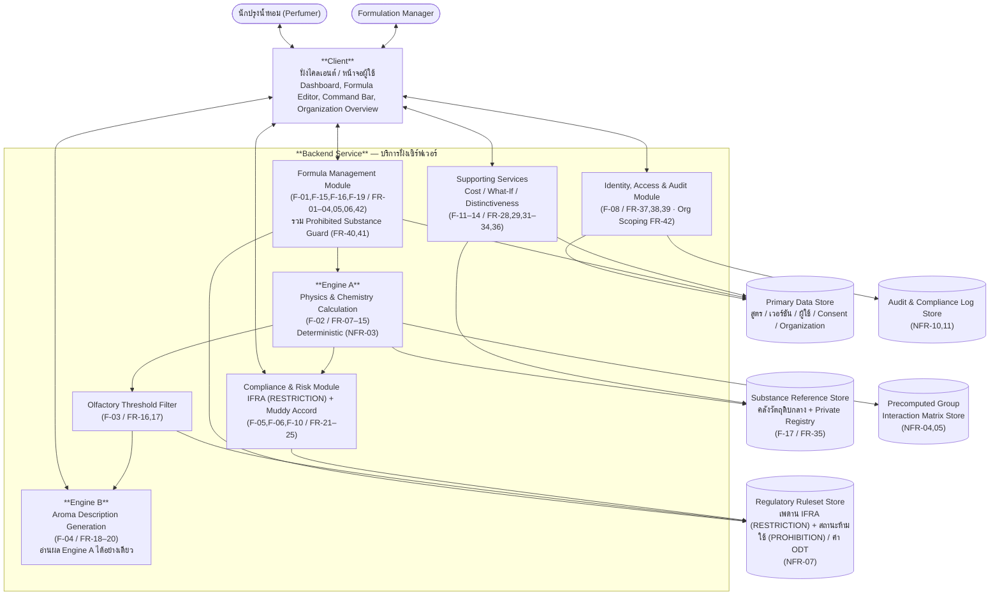
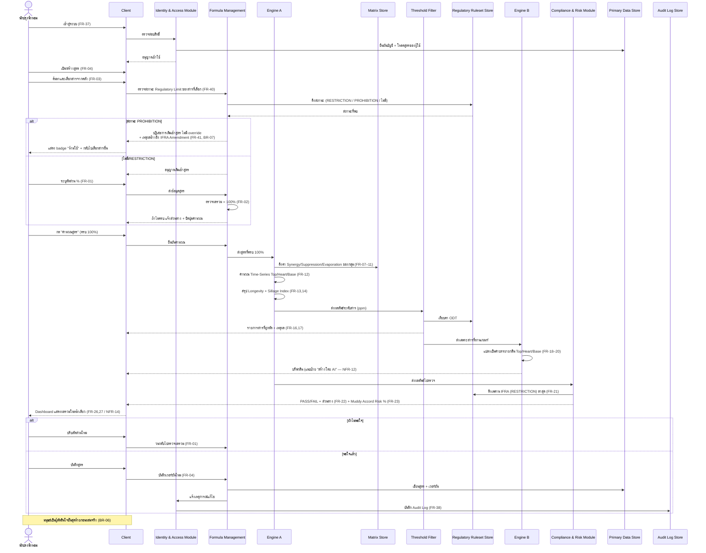
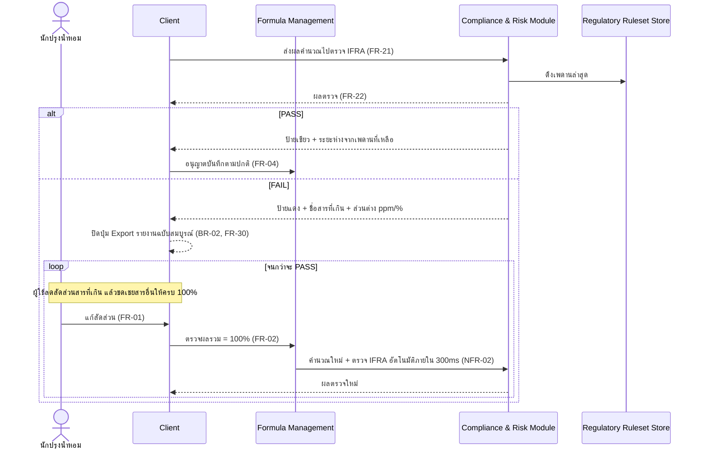
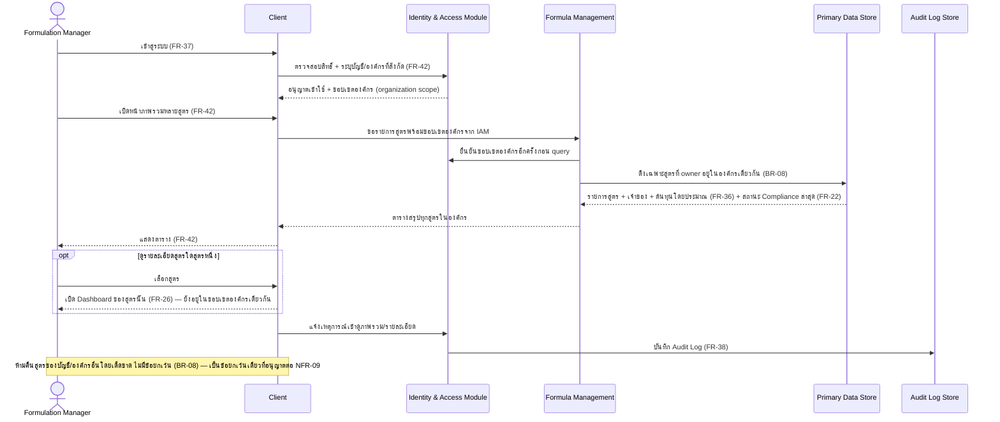

# Architecture — AI Perfumery Formulation Assistant

- **อัปเดตล่าสุด:** 2026-08-28
- **ระดับเอกสาร:** Logical / Conceptual Architecture — **ไม่ผูกกับ tech stack ใดๆ**
- **ที่มา:** [[../feature-list|Feature List]] + [[../user-journey|User Journey]] ← [[../../01-requirements/backlog|Product Backlog]] ← [[../../01-requirements/01-spec/20260818-01-ai-perfumery-core|Requirement Spec]] + [[../../01-requirements/01-spec/20260818-02-prohibited-substance-blocking|Prohibited Substance Blocking Spec]] + [[../../01-requirements/01-spec/20260818-03-formulation-manager-role|Formulation Manager Role Spec]]
- **สถานะ `[[technology-stack]]`:** ยังไม่มีไฟล์ / ยังไม่ตัดสินใจ — ทุก component ในเอกสารนี้จึงเขียนในระดับ **logical component** เท่านั้น ห้ามอ่านชื่อ component ใดๆ ด้านล่างว่าเป็นชื่อ framework/database/ภาษาโปรแกรม

> **หมายเหตุการอ่าน:** ทุก component และทุก data flow อ้างอิงรหัส `FR-xx`/`NFR-xx` กำกับเสมอ เพื่อให้สาวกลับไปหา [[../../01-requirements/backlog|backlog]] ต้นทางได้

---

## 1. ภาพรวม (Overview)

ระบบวางอยู่บนหลักการ **Two-Engine Core** ตามที่กำหนดไว้ใน `CLAUDE.md`:

- **Engine A (Physics & Chemistry)** — คำนวณตัวเลขจริงแบบ deterministic (NFR-03) ห้ามมีค่าสุ่ม
- **Engine B (Generative Description)** — แปลงตัวเลขจาก Engine A เป็นคำบรรยายกลิ่นเท่านั้น **ไม่มีสิทธิ์แก้ตัวเลข** (FR-19)
- **Human-in-the-loop** — นักปรุงน้ำหอมเป็นผู้ตัดสินใจขั้นสุดท้ายก่อนผสมจริงเสมอ (BR-06) ระบบไม่อนุมัติสูตรแทนมนุษย์

เอกสารนี้แปลหลักการดังกล่าว + [[../feature-list|Feature List]] (F-01 ถึง F-19) + [[../user-journey|User Journey]] (UJ-01 ถึง UJ-04) ให้เป็น **logical component** ที่มีขอบเขตความรับผิดชอบชัดเจน โดยยึด NFR ทั้ง 15 ข้อใน [[../../01-requirements/backlog|backlog]] เป็นตัวขับเคลื่อนการตัดสินใจด้านโครงสร้าง (เช่น การแยก Matrix Store ต่างหากเพื่อรองรับ NFR-04/NFR-05, การแยก Regulatory Ruleset Store เพื่อรองรับ NFR-07)

**หลักการออกแบบที่ยึดตลอดเอกสาร:**

1. Client ไม่คำนวณตรรกะทางเคมี/กฎหมายเอง — ทำหน้าที่แสดงผลและรับ input เท่านั้น
2. Engine B อ่านผลลัพธ์จาก Engine A ได้อย่างเดียว ไม่มีเส้นทางเขียนกลับ (กัน Hallucination ตัวเลข)
3. ทุกค่าที่แสดงบน Dashboard ต้องสาวย้อนกลับไปยัง component/rule ต้นทางได้ (NFR-08 Explainability)
4. ข้อมูลกฎเกณฑ์ที่เปลี่ยนบ่อย (เพดาน IFRA ทั้งชนิด RESTRICTION และ PROHIBITION) แยกออกจากตรรกะโปรแกรม เพื่ออัปเดตได้โดยไม่แก้โค้ด (NFR-07)
5. การตรวจสอบ PROHIBITION (FR-40, FR-41) ต้องเกิด **ที่จุดค้นหา/เลือกสาร** ไม่ใช่รอถึงจุดคำนวณสูตรเสร็จเหมือน RESTRICTION (FR-21, FR-22) — สองกลไกนี้ทำงานคู่ขนานกัน ไม่ทดแทนกัน
6. การมองเห็นข้ามสูตรของ Formulation Manager (FR-42) ต้อง**จำกัดขอบเขตด้วยบัญชี/องค์กรเดียวกันเท่านั้น** ทุกครั้ง (BR-08) — เป็นข้อยกเว้นเดียวที่อนุญาตต่อ NFR-09 ห้ามขยายเป็นการเข้าถึงข้ามบัญชี/องค์กรอื่น

---

## 2. Component Diagram

**หมายเหตุ:**
- เส้นระหว่าง `EA` → `EB` ไม่มีในแผนภาพ — ข้อมูลจาก Engine A ไหลผ่าน `TF` (Threshold Filter) ก่อนเสมอ เพื่อให้ Engine B ไม่มีสิทธิ์เห็น/อ้างอิงสารที่ถูกตัดออกแล้ว (FR-19, FR-20)
- เส้นใหม่ `FM` → `REG` คือกลไก Prohibited Substance Guard (FR-40, FR-41) — Formula Management Module ตรวจสถานะ Regulatory Limit ของสารทันทีที่ผู้ใช้เลือก/ก่อนเพิ่มเข้าสูตร แยกจากเส้นทาง `EA`→`CR`→`REG` ที่ตรวจ RESTRICTION หลังคำนวณเสร็จ
- `FM_USER` (Formulation Manager) คุยกับ `Client` เหมือน `U` แต่ `IAM` เป็นผู้บังคับ organization scoping ก่อนที่ `FM` จะคืนรายการสูตรข้ามผู้ใช้ให้ (FR-42, BR-08)

---

## 3. ขอบเขตความรับผิดชอบต่อ Component

### 3.1 Client
- แสดง Dashboard สรุปผลในหน้าเดียว (NFR-14), ฟอร์มสร้าง/แก้ไขสูตร, พีระมิดกลิ่น, Command Bar, และหน้า Organization Overview สำหรับ Formulation Manager (FR-42)
- บังคับกฎ UI เชิง business rule ที่ตรวจได้จากฝั่งแสดงผล เช่น ปิดปุ่ม "คำนวณ" เมื่อผลรวม ≠ 100% (FR-02), ปิดปุ่ม Export เมื่อ IFRA = FAIL (BR-02, FR-30), และ**ปิดการกดเลือกสารที่มี badge "ห้ามใช้ (PROHIBITION)" เข้าสูตรทันทีที่เห็นในผลค้นหา** (FR-40, FR-41)
- ปฏิบัติตาม NFR-15 (WCAG 2.1 AA) และแสดงป้าย "เนื้อหาสร้างโดย AI" ทุกครั้งที่แสดงผลจาก Engine B (NFR-12)
- **ไม่คำนวณ**ตรรกะเคมี/IFRA/Muddy Accord/สถานะ PROHIBITION เอง — ส่งต่อให้ Backend Service ตรวจสอบเสมอ (การแสดง badge เป็นการ "แสดงผล" สิ่งที่ Backend ตรวจแล้วเท่านั้น)

### 3.2 Identity, Access & Audit Module (F-08)
- ยืนยันตัวตนผู้ใช้ (FR-37), ควบคุมสิทธิ์การเข้าถึงสูตรตามความเป็นเจ้าของ (NFR-09)
- บันทึกทุก event การเข้าใช้/แก้ไขลง Audit & Compliance Log Store (FR-38, NFR-10)
- จัดการสถานะ Consent ตาม PDPA (FR-39, NFR-11) — ครอบคลุมโดย [[../user-journey#UJ-03 — Journey: จัดการความยินยอมข้อมูลส่วนบุคคล (PDPA)|UJ-03]]
- **ใหม่ — Organization Scoping (FR-42):** ระบุว่าผู้ใช้แต่ละคนสังกัดบัญชี/องค์กรใด และเป็นผู้บังคับ (enforce) เงื่อนไขนี้ก่อนที่ `Formula Management Module` จะคืนรายการสูตรข้ามผู้ใช้ให้บทบาท Formulation Manager — **นี่คือข้อยกเว้นเดียวที่อนุญาตต่อ NFR-09** (BR-08) ห้ามขยายไปยังบทบาทอื่นหรือข้ามบัญชี/องค์กรโดยไม่มีการอนุมัติเพิ่มเติม

### 3.3 Formula Management Module (F-01, F-15, F-16, F-19)
- รับ/บันทึก/เปิด/แก้ไขสูตร (FR-01, FR-04), ตรวจผลรวมสัดส่วน = 100% ก่อนส่งเข้า Engine A (FR-02)
- ค้นหาสารจาก Substance Reference Store (FR-03)
- **ใหม่ — Prohibited Substance Guard (FR-40, FR-41):** ทันทีที่ค้นหา/ก่อนเพิ่มสารเข้าสูตร ตรวจสถานะ Regulatory Limit ของสารนั้นกับ Regulatory Ruleset Store โดยตรง ถ้าสถานะเป็น **PROHIBITION** ต้องปฏิเสธการเพิ่มเข้าสูตรทันที **ไม่มี override ใดๆ** (BR-07) พร้อมส่งเหตุผลอ้างอิง IFRA Amendment กลับให้ Client แสดงผล — กลไกนี้ทำงาน**ก่อน**ที่สารจะเข้าสูตร แยกจาก `Compliance & Risk Module` ที่ตรวจ RESTRICTION **หลัง**คำนวณสูตรเสร็จ
- เก็บประวัติเวอร์ชันสูตร (FR-05) และรองรับนำเข้าจากไฟล์ภายนอก (FR-06)
- **ใหม่ — Multi-Formula Overview (FR-42):** รองรับการดึงรายการสูตรแบบข้ามผู้ใช้ ให้เฉพาะ**ภายในขอบเขตบัญชี/องค์กรเดียวกัน**ที่ `Identity, Access & Audit Module` ยืนยันมาแล้วเท่านั้น (BR-08) สำหรับหน้า Organization Overview ของ Formulation Manager — ต้องปฏิเสธถ้าไม่มีการยืนยันขอบเขตองค์กรมาก่อน

### 3.4 Engine A — Physics & Chemistry Calculation (F-02)
- ระบุ Micro-Cluster ของสาร → คำนวณน้ำหนัก % กลุ่ม → ดึง Synergy/Suppression/Evaporation Shift จาก Matrix Store → คำนวณ Time-Series Top/Heart/Base → สรุป Longevity + Sillage Index (FR-07–14)
- รองรับ Fine-tune ระดับรายสารด้วย Master Code (FR-15)
- **ต้อง deterministic 100%** (NFR-03) — input เดิมต้องให้ผลเดิมทุกครั้ง ห้ามมีองค์ประกอบสุ่ม
- เป็น**แหล่งความจริงเดียว**ของตัวเลขทั้งหมดในระบบ — component อื่นห้ามคำนวณตัวเลขเคมีซ้ำเอง

### 3.5 Olfactory Threshold Filter (F-03)
- เทียบความเข้มข้นที่ระเหยจริง (ppm) กับค่า ODT จาก Regulatory Ruleset Store แล้วตัดสารที่ต่ำกว่าเกณฑ์ออกจากบรีฟ (FR-16)
- ส่งต่อ**เฉพาะ**รายการสารที่ผ่านเกณฑ์ให้ Engine B และเก็บรายการที่ถูกตัด+เหตุผลไว้แสดงผู้ใช้เสมอ (FR-17, NFR-08)

### 3.6 Engine B — Aroma Description Generation (F-04)
- แปลงตัวเลขที่ผ่านการกรองแล้วเป็นคำบรรยายกลิ่นแยกชั้น Top/Heart/Base (FR-18, FR-20)
- **ไม่มีสิทธิ์สร้างหรือแก้ไขตัวเลขใดๆ** และห้ามอ้างถึงสารที่ถูก ODT ตัดไปแล้ว (FR-19) — เส้นแบ่งนี้คือกลไกกัน Hallucination หลักของระบบ
- ทุก output ต้องแนบสถานะ "สร้างโดย AI" (NFR-12) และมี fallback เมื่อ generation ล้มเหลว/มั่นใจต่ำ (NFR-13)

### 3.7 Compliance & Risk Module (F-05, F-06, F-10)
- ตรวจเพดาน IFRA 51st ประเภท RESTRICTION ทั้งรายสาร/รายกลุ่มแบบ real-time (FR-21) โดยดึงเพดานจาก Regulatory Ruleset Store เสมอ (NFR-07) พร้อมแสดง PASS/FAIL + ส่วนต่าง + ชื่อสารที่เกิน (FR-22)
- ตรวจจับ Muddy Accord Risk 0–100% (FR-23) และแนะนำช่วงสัดส่วนที่ควรปรับ (FR-24)
- เตือน Scent Drift เมื่อบรีฟเบี่ยงจากบรีฟตั้งต้น (FR-25) — เกณฑ์ตัวเลขยังเป็น Open Issue OI-01 ตาม [[../../05-log/20260818-log|log]]
- **ไม่รับผิดชอบ**การตรวจ PROHIBITION — งานนั้นเป็นของ `Formula Management Module` ที่จุดเลือกสาร (ดู 3.3)

### 3.8 Supporting Services (F-11, F-12, F-13, F-14)
- What-If Simulation: คำนวณเฉพาะ diff เมื่อสลับสาร ไม่คำนวณสูตรใหม่ทั้งหมด (FR-31, FR-32)
- Member-Level Distinctiveness: แสดงสมาชิกในกลุ่ม + การ์ดเอกลักษณ์ (FR-33, FR-34)
- Cost Calculation: ต้นทุนวัตถุดิบต่อกิโลกรัม (FR-36)
- Visualization/Command Bar เชิงลึก (FR-28, FR-29)

### 3.9 Primary Data Store
- เก็บสูตร, เวอร์ชัน, บัญชีผู้ใช้, สถานะ Consent — เข้ารหัสข้อมูลสูตรและแยกสิทธิ์ตามบัญชี (NFR-09)
- **ใหม่:** เก็บข้อมูลการจัดกลุ่มบัญชี/องค์กร (Organization) เพื่อให้ `Identity, Access & Audit Module` ใช้เป็นเงื่อนไขกรองสำหรับมุมมองข้ามสูตรของ Formulation Manager (FR-42) — รายละเอียด entity/attribute อยู่ใน `db-spec.md`

### 3.10 Substance Reference Store
- คลังวัตถุดิบกลาง รองรับ 2,000–3,000 ชนิด (NFR-06) + คลังสารส่วนตัวของผู้ใช้ (Private Registry, FR-35) — ค้นหาได้ด้วยชื่อ/CAS/รหัสภายใน (FR-03)

### 3.11 Precomputed Group Interaction Matrix Store
- เก็บค่า Synergy/Suppression/Evaporation ที่คำนวณล่วงหน้าระดับ Micro-Cluster จำกัดไม่เกิน 100 กลุ่ม (NFR-04) เพื่อให้เพิ่มสารใหม่ได้โดยไม่ต้องคำนวณ matrix ใหม่ทั้งระบบ (NFR-05)

### 3.12 Regulatory Ruleset Store
- เก็บเพดาน IFRA 51st ประเภท RESTRICTION, สถานะห้ามใช้เด็ดขาดประเภท PROHIBITION, และค่า ODT รายสาร แยกจากตรรกะโปรแกรม เพื่ออัปเดตฐานข้อมูลกฎเกณฑ์ได้โดยไม่ต้องแก้โค้ด (NFR-07) — แหล่งข้อมูล ODT ยังเป็น Open Issue OI-03
- **ถูกเรียกจาก 2 เส้นทางแยกกัน:** `FM`→`REG` (ตรวจ PROHIBITION ก่อนเข้าสูตร, FR-40/41) และ `EA`→`CR`→`REG` (ตรวจ RESTRICTION หลังคำนวณ, FR-21/22) — ทั้งสองอ่านจากแหล่งข้อมูลเดียวกันเสมอเพื่อไม่ให้เพดาน/สถานะไม่ตรงกัน

### 3.13 Audit & Compliance Log Store
- เก็บ Traffic Log ตาม พ.ร.บ.คอมพิวเตอร์ ม.26 (≥ 90 วัน, NFR-10) และ Audit Log การเข้าใช้/แก้ไขสูตร รวมถึงการเข้าดู Organization Overview ของ Formulation Manager (FR-38, FR-42) แยกจาก Primary Data Store เพื่อให้กำหนดนโยบาย retention ได้อิสระ

---

## 4. Data Flow Diagram ต่อ Journey หลัก

### 4.1 UJ-01 — ป้อนสูตรและอ่านผลวิเคราะห์บน Dashboard (รวม Prohibited Substance Guard)

> อ้างอิง [[../user-journey#UJ-01 — Journey หลัก: ป้อนสูตรและอ่านผลวิเคราะห์บน Dashboard|UJ-01]]

### 4.2 UJ-02 — เจอ IFRA FAIL แล้วแก้สูตรจนผ่าน

> อ้างอิง [[../user-journey#UJ-02 — Journey รอง: เจอ IFRA FAIL แล้วแก้สูตรจนผ่าน|UJ-02]] — แตกจากขั้นที่ 15 ของ UJ-01

### 4.3 UJ-04 — มุมมองภาพรวมหลายสูตรของ Formulation Manager

> อ้างอิง [[../user-journey#UJ-04 — Journey: มุมมองภาพรวมหลายสูตรของ Formulation Manager|UJ-04]] — journey ใหม่ที่ปิด OI-06 พร้อมทดสอบเส้นทาง Organization Scoping ที่ปิด OI-05

> **UJ-03 (จัดการความยินยอม PDPA) ไม่มี Data Flow Diagram แยกต่างหาก** เพราะไม่ได้เพิ่ม component ใหม่ — ใช้ operation ของ `Identity, Access & Audit Module` ที่ออกแบบไว้แล้วในหัวข้อ 3.2 ทั้งหมด (flow ข้อมูลเหมือนกับ event อื่นที่ IAM จัดการอยู่แล้ว)

---

## 5. ตาราง Mapping NFR → Component

| รหัส NFR | คำอธิบายสั้น | Component ที่รับผิดชอบหลัก | แนวทางเชิงหลักการ |
|---|---|---|---|
| NFR-01 | คำนวณสูตร 50–80 สาร ภายใน 500ms | Engine A + Precomputed Matrix Store | ใช้ค่าที่คำนวณล่วงหน้าระดับกลุ่มแทนการคำนวณคู่สารแบบสด, คำนวณเฉพาะกลุ่มที่เปลี่ยนเมื่อแก้สัดส่วน |
| NFR-02 | ตรวจ IFRA real-time ภายใน 300ms | Compliance & Risk Module + Regulatory Ruleset Store | ตรวจเพดานแบบ incremental เฉพาะสารที่เปลี่ยน ไม่ตรวจทั้งสูตรใหม่ทุกครั้ง |
| NFR-03 | Engine A ต้อง deterministic ทำซ้ำได้ 100% | Engine A | ออกแบบเป็น pure function ของ (input สูตร + ข้อมูล Matrix) ห้ามมีองค์ประกอบสุ่มหรือขึ้นกับสถานะภายนอกที่ควบคุมไม่ได้ |
| NFR-04 | Matrix จำกัดไม่เกิน 100 Micro-Clusters | Precomputed Interaction Matrix Store | ตรวจสอบขนาด matrix เป็นเงื่อนไขตอนโหลด/อัปเดตข้อมูล ปฏิเสธหากเกินเพดานที่ออกแบบไว้ |
| NFR-05 | เพิ่มสารใหม่ไม่ต้องคำนวณ Matrix ใหม่ทั้งระบบ | Precomputed Interaction Matrix Store + Engine A | จัดทำ index ตาม Micro-Cluster ไม่ใช่ตามรายสาร — สารใหม่แค่ map เข้ากลุ่มเดิม ไม่กระทบ matrix ที่มีอยู่ |
| NFR-06 | รองรับคลังสาร 2,000–3,000 ชนิด | Substance Reference Store | ออกแบบให้ค้นหา/กรองได้ตามขนาดนี้โดยไม่ลดทอนความเร็วของ FR-03 |
| NFR-07 | อัปเดตฐาน IFRA ได้โดยไม่แก้โค้ด | Regulatory Ruleset Store + Compliance & Risk Module + Formula Management Module | แยกกฎเกณฑ์ (ทั้ง RESTRICTION และ PROHIBITION) ออกเป็นข้อมูลที่จัดการ/versioned ต่างหากจาก logic ของโปรแกรม |
| NFR-08 | ทุกค่าบน Dashboard สาวกลับที่มาได้ | ทุก Backend module + Client | ทุกค่าที่คำนวณพก reference กลับไปยัง component/กฎ/สารต้นทางเสมอ แสดงผลให้ผู้ใช้ตรวจสอบได้ |
| NFR-09 | เข้ารหัสสูตร + แยกสิทธิ์ตามบัญชี | Primary Data Store + Identity & Access Module | เข้ารหัสข้อมูลสูตรที่พัก (at rest) + ควบคุมสิทธิ์อ่าน/เขียนตามความเป็นเจ้าของบัญชี — **ยกเว้นบทบาท Formulation Manager ที่เข้าถึงได้เฉพาะสูตรภายในบัญชี/องค์กรเดียวกันตาม FR-42/BR-08 เท่านั้น** (ข้อเสนอปรับถ้อยคำ NFR-09 อยู่ระหว่างรอการยืนยันอย่างเป็นทางการใน `nfr-review.md`) |
| NFR-10 | เก็บ Traffic Log ≥ 90 วัน (พ.ร.บ.คอมฯ ม.26) | Audit & Compliance Log Store | เก็บ log แบบ append-only พร้อมนโยบาย retention ≥ 90 วันที่แยกจากข้อมูลสูตร |
| NFR-11 | Consent + สิทธิเจ้าของข้อมูล (PDPA) | Identity & Access Module + Primary Data Store | เก็บสถานะ consent ต่อผู้ใช้ เปิดช่องทางให้ผู้ใช้ใช้สิทธิ (เข้าถึง/ลบ/ถอน consent) ผ่านหน้าตั้งค่าบัญชี ([[../user-journey#UJ-03 — Journey: จัดการความยินยอมข้อมูลส่วนบุคคล (PDPA)|UJ-03]]) |
| NFR-12 | แจ้งผู้ใช้ว่าบรีฟสร้างโดย AI | Engine B + Client | แนบสถานะ "AI-generated" กับทุก output ของ Engine B และบังคับ Client แสดงป้ายนี้เสมอ |
| NFR-13 | มี Fallback Plan + ระบุผู้รับผิดชอบ | Engine B (ระดับระบบ) + กระบวนการนอกระบบ | กำหนดพฤติกรรม fallback เมื่อ generation ล้มเหลว/มั่นใจต่ำ (เช่น แสดงตัวเลขดิบจาก Engine A แทนคำบรรยาย) — ส่วน "ผู้รับผิดชอบ" เป็นประเด็นกระบวนการ/องค์กรที่ architecture ระดับนี้รองรับได้แค่ hook ทางเทคนิค |
| NFR-14 | ผลสรุปหลักอ่านครบใน 1 หน้าจอ | Client (Dashboard) | จำกัด layout ของ Dashboard component ให้แสดงองค์ประกอบหลักทั้งหมดโดยไม่ต้องเลื่อนจอ |
| NFR-15 | Contrast ผ่าน WCAG 2.1 AA | Client | ยึด [[../DESIGN|Design System]] เป็นมาตรฐานสี/contrast ของทุกองค์ประกอบ UI |

---

## 6. ประเด็นรอตัดสินใจ

การตัดสินใจเชิงเทคนิคต่อไปนี้**ยังไม่เกิดขึ้น** และต้องรอ [[technology-stack|technology-stack.md]] ก่อนจึงจะระบุรายละเอียดต่อได้ เอกสารนี้จงใจไม่ฟันธงเรื่องเหล่านี้:

1. **Data Store engine** ของแต่ละ store ทั้ง 5 ชนิด (Primary, Substance Reference, Matrix, Regulatory Ruleset, Audit Log) — จะใช้ engine เดียวกันหรือแยกกันตามลักษณะข้อมูล (structured vs append-only log) ยังไม่ตัดสินใจ
2. **กลไกเข้ารหัสข้อมูลสูตร** สำหรับ NFR-09 (algorithm, key management) — รอ technology-stack.md
3. **Engine A / Engine B เป็น service แยกกันจริงหรือเป็น module ภายใน backend เดียวกัน** — เอกสารนี้แยกด้วยเหตุผลเชิงความรับผิดชอบ (separation of concerns) เท่านั้น ไม่ใช่ข้อสรุปเรื่อง deployment
4. **วิธี precompute และ refresh Precomputed Interaction Matrix Store** (batch/on-demand, ความถี่) — กระทบ NFR-01/NFR-05 โดยตรง แต่เป็นรายละเอียด implementation ที่รอ tech stack
5. **โปรโตคอลสื่อสารระหว่าง Client ↔ Backend Service** และรูปแบบสัญญา API — ส่งต่อให้ [[api-spec|api-spec.md]]
6. **โครงสร้างข้อมูลจริงของแต่ละ store** — ส่งต่อให้ [[db-spec|db-spec.md]]
7. **กลไก authentication/authorization ที่ใช้จริง** (session/token/รูปแบบใด) สำหรับ Identity & Access Module — รอ technology-stack.md
8. **Hosting/Infrastructure scaling** สำหรับรองรับ NFR-01, NFR-02, NFR-05, NFR-06 — รอ technology-stack.md
9. **กลไก enforce Organization Scoping จริง** สำหรับ FR-42 (ตรวจที่ชั้น query ของ data store, ชั้น service, หรือทั้งสองชั้น) — แนวคิดเชิง logical (Organization เป็นเงื่อนไขกรองที่ `Identity, Access & Audit Module` ต้องยืนยันก่อนทุกครั้ง) ปิดช่องว่าง OI-05 แล้ว แต่กลไกจริงยังรอ technology-stack.md เช่นเดียวกับข้อ 1–8

---

## 7. เอกสารที่เกี่ยวข้อง

| เอกสาร | ความสัมพันธ์ |
|---|---|
| [[../feature-list|Feature List]] | แหล่งฟีเจอร์ (F-01–F-19) ที่ map เข้า component ในเอกสารนี้ |
| [[../user-journey|User Journey]] | Journey ต้นทางของ Data Flow Diagram ทั้ง 3 ภาพ (UJ-01, UJ-02, UJ-04) |
| [[../../01-requirements/backlog|Backlog]] | แหล่ง FR/NFR ทั้งหมดที่ใช้ mapping ในหัวข้อ 5 |
| [[../../01-requirements/01-spec/20260818-01-ai-perfumery-core|Requirement Spec]] | ต้นทางของ Business Rules (เช่น BR-02, BR-06) ที่อ้างถึงใน Data Flow |
| [[../../01-requirements/01-spec/20260818-02-prohibited-substance-blocking|Prohibited Substance Blocking Spec]] | ต้นทางของ FR-40, FR-41, BR-07 ที่ปิดช่องว่างในเอกสารนี้ |
| [[../../01-requirements/01-spec/20260818-03-formulation-manager-role|Formulation Manager Role Spec]] | ต้นทางของ FR-42, BR-08, OI-05 ที่ปิดช่องว่างในเอกสารนี้ |
| [[technology-stack|Technology Stack]] | ยังว่างเปล่า — จุดที่จะตัดสินใจประเด็นในหัวข้อ 6 |
| [[api-spec|API Spec]] / [[db-spec|DB Spec]] | Operation/Entity ที่รองรับ component ในเอกสารนี้ |
| [[../DESIGN|Design System]] | มาตรฐาน UI/Accessibility ที่ Client component ต้องยึด (NFR-15) |
