# DB Spec — AI Perfumery Formulation Assistant

- **อัปเดตล่าสุด:** 2026-08-28
- **ระดับเอกสาร:** Logical / Conceptual Data Model — **ไม่ผูกกับ database engine ใดๆ** (ไม่ใช้ SQL type, ไม่ระบุว่าเป็น SQL/NoSQL/เอกสาร/กราฟ)
- **ที่มา:** [[architecture|Architecture]] ← [[../feature-list|Feature List]] + [[../user-journey|User Journey]] ← [[../../01-requirements/backlog|Product Backlog]] ← [[../../01-requirements/01-spec/20260818-01-ai-perfumery-core|Requirement Spec]] + [[../../01-requirements/01-spec/20260818-03-formulation-manager-role|Formulation Manager Role Spec]]
- **สถานะ `[[technology-stack]]`:** ยังไม่มีไฟล์ / ยังไม่ตัดสินใจ — ทุก entity ด้านล่างเขียนในระดับ **logical/conceptual** เท่านั้น
- **คู่กันกับ:** [[api-spec|API Spec]] — ทุก field ที่ปรากฏใน operation ของ api-spec.md ต้องตรงกับ attribute ของ entity ในเอกสารนี้

> **หมายเหตุการอ่าน:** ชนิดข้อมูลที่ใช้ในเอกสารนี้มีเพียง 5 แบบเชิงตรรกะ: **ข้อความ**, **ตัวเลข**, **วันที่-เวลา**, **จริง/เท็จ**, **อ้างอิง** (อ้างถึง entity อื่นด้วยรหัสของ entity นั้น) — คอลัมน์ "key" ระบุ `PK` (primary identifier ของ entity) หรือ `FK` (ค่าที่อ้างถึง entity อื่น) ทุก entity/attribute อ้างอิงรหัส `FR-xx`/`NFR-xx` กำกับเสมอ

---

## 1. ภาพรวมโมเดลข้อมูล

โมเดลนี้แปลง 5 logical store ที่ [[architecture#2. Component Diagram|architecture.md]] วางไว้ (Primary Data Store, Substance Reference Store, Precomputed Group Interaction Matrix Store, Regulatory Ruleset Store, Audit & Compliance Log Store) ให้เป็น entity ระดับ logical/ER โดยจัดกลุ่มตามความรับผิดชอบเดิม:

| กลุ่ม Entity | สังกัด Logical Store (จาก architecture.md) | ครอบคลุม FR/NFR หลัก |
|---|---|---|
| 1. บัญชี ความยินยอม, Organization และ Audit | Primary Data Store + Audit & Compliance Log Store | FR-37–39, FR-42, NFR-09–11 |
| 2. การจัดการสูตร | Primary Data Store | FR-01–06 |
| 3. คลังวัตถุดิบและกลุ่มจุลภาค | Substance Reference Store + Precomputed Interaction Matrix Store | FR-03, FR-07, FR-09–11, FR-15, FR-35, NFR-04–06 |
| 4. ผลการคำนวณ Engine A + Threshold Filter | Primary Data Store (ผลลัพธ์ผูกกับเวอร์ชันสูตร) | FR-08, FR-12–14, FR-16–17, NFR-01, NFR-03, NFR-08 |
| 5. คำบรรยายกลิ่น (Engine B) | Primary Data Store | FR-18–20, NFR-12–13 |
| 6. Compliance & Risk | Regulatory Ruleset Store + Primary Data Store | FR-21–25, NFR-02, NFR-07 |
| 7. Supporting Services (What-If / Distinctiveness / Cost) | Primary Data Store | FR-28, FR-31–34, FR-36 |
| 8. Export | Primary Data Store | FR-30, BR-02 |

**หลักการออกแบบที่ยึดตลอดเอกสาร:**
1. ผลลัพธ์ของ Engine A/B/Compliance ทุกชั้นผูกกับ **การคำนวณหนึ่งครั้ง** (`FormulaCalculationRun`) เสมอ ไม่เขียนทับกัน — เพื่อรองรับ NFR-08 (สาวกลับที่มาได้) และ NFR-03 (ต้องตรวจสอบได้ว่า input เดิมให้ผลเดิม)
2. สารที่ถูก Threshold Filter ตัดออก **ไม่ถูกลบ** จาก `FormulaVersionIngredient` — มีแค่ flag ใน `ThresholdFilterOutcome` (BR-03: ยังต้องถูกนับในการคำนวณ IFRA และต้นทุน)
3. `RegulatoryLimit` ออกแบบให้ครอบคลุมทั้งกรณี "มีเพดาน %" และ "ห้ามใช้เด็ดขาด" เพราะข้อมูล IFRA จริงมีทั้งสองแบบ (ดูหมายเหตุในหัวข้อ 3.6 และ `## NEEDS_NEW_REQUIREMENT` ในรายงาน)
4. ไม่มี attribute ใดเก็บรายละเอียดกลไกเข้ารหัส/authentication จริง — สิ่งเหล่านี้เป็น**ประเด็นรอตัดสินใจ**ที่ต้องรอ `technology-stack.md`

---

## 2. ER Diagram (โครงสร้างหลักและความสัมพันธ์)

```mermaid
erDiagram
    ORGANIZATION ||--o{ USER : "groups (FR-42)"
    USER ||--o{ FORMULA : "owns (NFR-09)"
    USER ||--o{ CONSENT_RECORD : "gives (FR-39)"
    USER ||--o{ DATA_SUBJECT_REQUEST : "submits (NFR-11)"
    USER ||--o{ AUDIT_LOG_ENTRY : "generates (FR-38)"
    USER ||--o{ SUBSTANCE : "owns private entry (FR-35)"
    USER ||--o{ FORMULA_IMPORT_BATCH : "uploads (FR-06)"

    FORMULA ||--o{ FORMULA_VERSION : "has versions (FR-05)"
    FORMULA ||--o{ FORMULA_IMPORT_BATCH : "created via"
    FORMULA_VERSION ||--o{ FORMULA_VERSION_INGREDIENT : "contains (FR-01)"
    SUBSTANCE ||--o{ FORMULA_VERSION_INGREDIENT : "used as"

    MICRO_CLUSTER ||--o{ SUBSTANCE : "classifies (FR-07)"
    MICRO_CLUSTER ||--o{ GROUP_INTERACTION_MATRIX_ENTRY : "cluster_a"
    MICRO_CLUSTER ||--o{ GROUP_INTERACTION_MATRIX_ENTRY : "cluster_b"

    FORMULA_VERSION ||--o{ FORMULA_CALCULATION_RUN : "produces (FR-07-14)"
    FORMULA_CALCULATION_RUN ||--o{ CALCULATION_CLUSTER_WEIGHT : "has (FR-08)"
    MICRO_CLUSTER ||--o{ CALCULATION_CLUSTER_WEIGHT : "weighted"

    FORMULA_CALCULATION_RUN ||--o{ CALCULATION_TIME_SERIES_POINT : "has (FR-12)"
    SUBSTANCE ||--o{ CALCULATION_TIME_SERIES_POINT : "evaporates as"

    FORMULA_CALCULATION_RUN ||--o{ THRESHOLD_FILTER_OUTCOME : "has (FR-16-17)"
    SUBSTANCE ||--o{ THRESHOLD_FILTER_OUTCOME : "filtered as"

    FORMULA_CALCULATION_RUN ||--o{ AROMA_DESCRIPTION_SEGMENT : "has (FR-18-20)"
    AROMA_DESCRIPTION_SEGMENT ||--o{ AROMA_DESCRIPTION_CLUSTER_REF : "cites"
    MICRO_CLUSTER ||--o{ AROMA_DESCRIPTION_CLUSTER_REF : "cited by"

    FORMULA_CALCULATION_RUN ||--o{ COMPLIANCE_CHECK_RESULT : "has (FR-21-22)"
    COMPLIANCE_CHECK_RESULT ||--o{ COMPLIANCE_VIOLATION : "lists"
    REGULATORY_LIMIT ||--o{ COMPLIANCE_VIOLATION : "violated"
    SUBSTANCE ||--o{ REGULATORY_LIMIT : "limited per-substance"
    MICRO_CLUSTER ||--o{ REGULATORY_LIMIT : "limited per-cluster"

    FORMULA_CALCULATION_RUN ||--o{ MUDDY_ACCORD_ASSESSMENT : "has (FR-23)"
    MUDDY_ACCORD_ASSESSMENT ||--o{ MUDDY_ACCORD_RECOMMENDATION : "suggests (FR-24)"
    MICRO_CLUSTER ||--o{ MUDDY_ACCORD_RECOMMENDATION : "targets"

    FORMULA_CALCULATION_RUN ||--o{ SCENT_DRIFT_ASSESSMENT : "has (FR-25)"
    FORMULA_CALCULATION_RUN ||--o{ SCENT_DRIFT_ASSESSMENT : "is baseline for"

    FORMULA_VERSION ||--o{ WHAT_IF_SIMULATION : "is base of (FR-31)"
    SUBSTANCE ||--o{ WHAT_IF_SIMULATION : "removed in"
    SUBSTANCE ||--o{ WHAT_IF_SIMULATION : "added in"
    FORMULA_CALCULATION_RUN ||--o{ WHAT_IF_SIMULATION : "results in"
    WHAT_IF_SIMULATION ||--o{ WHAT_IF_DIFF_RESULT : "has (FR-32)"

    SUBSTANCE ||--o{ DISTINCTIVENESS_CARD : "described by (FR-34)"

    FORMULA_CALCULATION_RUN ||--o{ COST_BREAKDOWN_ENTRY : "has (FR-36)"
    SUBSTANCE ||--o{ COST_BREAKDOWN_ENTRY : "contributes"

    FORMULA_CALCULATION_RUN ||--o{ EXPORTED_REPORT : "exported as (FR-30)"
    USER ||--o{ EXPORTED_REPORT : "requests"
```

> **หมายเหตุขนาดแผนภาพ:** เพื่อความอ่านง่าย แผนภาพนี้แสดงเฉพาะความสัมพันธ์ระดับ entity — attribute ครบทั้งหมดของแต่ละ entity (พร้อม `PK`/`FK` และชนิดข้อมูลเชิงตรรกะ) อยู่ในหัวข้อ 3 ด้านล่าง

---

## 3. รายละเอียด Entity

### 3.1 บัญชี ความยินยอม, Organization และ Audit (F-08, F-19 / FR-37–39, FR-42 / NFR-09,10,11)

#### `Organization` — กลุ่มบัญชี/องค์กร
FR-42 · BR-08 · ปิดช่องว่าง **OI-05** ใน [[../../01-requirements/01-spec/20260818-03-formulation-manager-role|Formulation Manager Role Spec]]

| Attribute | ชนิดข้อมูล | Key | คำอธิบาย |
|---|---|---|---|
| organization_id | ข้อความ | PK | รหัสอ้างอิงองค์กร/บัญชีกลุ่ม |
| name | ข้อความ | | ชื่อองค์กร/สตูดิโอ |
| created_at | วันที่-เวลา | | |

> ใช้เป็นขอบเขตเดียวที่จำกัดมุมมองข้ามสูตรของ Formulation Manager (FR-42) — `Formula` ที่เจ้าของ (`User.organization_ref`) ไม่อยู่ใน `Organization` เดียวกันต้อง**ไม่ปรากฏ**ในผลลัพธ์เด็ดขาด (BR-08) ไม่มีความสัมพันธ์ N:M กับ `User` ในเวอร์ชันนี้ (ผู้ใช้ 1 คนสังกัด 1 องค์กรเท่านั้น — ถ้าต้องรองรับหลายองค์กรต่อผู้ใช้ในอนาคตต้องออกแบบ join entity เพิ่ม)

#### `User` — บัญชีผู้ใช้
อ้างอิง [[architecture#3.2 Identity, Access & Audit Module (F-08)|Identity & Access Module]] · FR-37 · NFR-09 · บทบาทตาม [[../../01-requirements/01-spec/20260818-01-ai-perfumery-core#2. บทบาทผู้ใช้ (User Roles)|Requirement Spec §2]]

| Attribute | ชนิดข้อมูล | Key | คำอธิบาย |
|---|---|---|---|
| user_id | ข้อความ | PK | รหัสอ้างอิงผู้ใช้ |
| display_name | ข้อความ | | ชื่อที่แสดงในระบบ |
| email | ข้อความ | | อีเมล (PII ตาม NFR-11) |
| role | ข้อความ | | หนึ่งใน: Perfumer / Formulation Manager / Data Steward |
| organization_ref | อ้างอิง | FK → Organization | องค์กร/บัญชีกลุ่มที่ผู้ใช้สังกัด — ใช้กรองมุมมองข้ามสูตรของ Formulation Manager เท่านั้น (FR-42) ไม่กระทบสิทธิ์เข้าถึงสูตรปกติของ Perfumer ที่ยังคงอิงจาก `Formula.owner_ref` เพียงอย่างเดียว |
| is_active | จริง/เท็จ | | บัญชียังใช้งานได้หรือถูกปิดแล้ว |
| created_at | วันที่-เวลา | | วันที่เปิดบัญชี |

> **ไม่รวม** attribute เกี่ยวกับ credential/session ใดๆ — กลไก authentication จริงเป็นประเด็นรอตัดสินใจ (ดูหัวข้อ 5)

#### `ConsentRecord` — บันทึกความยินยอม
FR-39 · NFR-11

| Attribute | ชนิดข้อมูล | Key | คำอธิบาย |
|---|---|---|---|
| consent_id | ข้อความ | PK | รหัสอ้างอิง |
| user_ref | อ้างอิง | FK → User | เจ้าของความยินยอม |
| consent_type | ข้อความ | | ประเภท เช่น "เก็บข้อมูลส่วนบุคคลเพื่อใช้งานระบบ" |
| status | ข้อความ | | ให้ความยินยอม / ถอนความยินยอม |
| given_at | วันที่-เวลา | | วันที่ให้ความยินยอม |
| withdrawn_at | วันที่-เวลา | | วันที่ถอน (ไม่มีค่าถ้ายังไม่ถอน) |

#### `DataSubjectRequest` — คำขอใช้สิทธิเจ้าของข้อมูล
NFR-11 (สิทธิรับรู้/เข้าถึง/แก้ไข/ลบ/คัดค้านการประมวลผลตาม PDPA)

| Attribute | ชนิดข้อมูล | Key | คำอธิบาย |
|---|---|---|---|
| request_id | ข้อความ | PK | รหัสอ้างอิง |
| user_ref | อ้างอิง | FK → User | ผู้ยื่นคำขอ |
| request_type | ข้อความ | | เข้าถึงข้อมูล / แก้ไขข้อมูล / ลบข้อมูล / คัดค้านการประมวลผล |
| status | ข้อความ | | รอดำเนินการ / เสร็จสิ้น / ปฏิเสธ |
| requested_at | วันที่-เวลา | | วันที่ยื่นคำขอ |
| resolved_at | วันที่-เวลา | | วันที่ดำเนินการเสร็จ (ไม่มีค่าถ้ายังรอ) |
| resolution_note | ข้อความ | | คำอธิบายผลการดำเนินการ |

#### `AuditLogEntry` — รายการบันทึกการใช้งาน/แก้ไข
FR-38 · NFR-10 (พ.ร.บ.คอมพิวเตอร์ ม.26 — เก็บ ≥ 90 วัน)

| Attribute | ชนิดข้อมูล | Key | คำอธิบาย |
|---|---|---|---|
| log_id | ข้อความ | PK | รหัสอ้างอิง |
| user_ref | อ้างอิง | FK → User | ผู้ทำรายการ |
| action_type | ข้อความ | | เช่น เข้าสู่ระบบ / สร้างสูตร / บันทึกเวอร์ชัน / ส่งออกรายงาน |
| target_entity_type | ข้อความ | | ชื่อ entity ที่ถูกกระทำ (เช่น "Formula") |
| target_entity_ref | ข้อความ | | รหัสของ entity นั้น (อ้างอิงทั่วไป — ไม่ผูก entity เดียว) |
| occurred_at | วันที่-เวลา | | เวลาที่เกิดเหตุการณ์ |
| ip_address | ข้อความ | | ที่อยู่ IP ตามที่ พ.ร.บ.คอมฯ ม.26 กำหนดให้เก็บ |
| detail_note | ข้อความ | | รายละเอียดสิ่งที่เปลี่ยน |

---

### 3.2 การจัดการสูตร (F-01, F-15, F-16 / FR-01–06)

#### `Formula` — สูตรน้ำหอม
FR-01 · FR-04 · NFR-09

| Attribute | ชนิดข้อมูล | Key | คำอธิบาย |
|---|---|---|---|
| formula_id | ข้อความ | PK | รหัสอ้างอิง |
| owner_ref | อ้างอิง | FK → User | เจ้าของสูตร (ควบคุมสิทธิ์เข้าถึงตาม NFR-09) |
| name | ข้อความ | | ชื่อสูตร |
| brief_note | ข้อความ | | บรีฟตั้งต้นจากลูกค้า — ใช้เทียบ Scent Drift (FR-25) |
| current_version_ref | อ้างอิง | FK → FormulaVersion | เวอร์ชันล่าสุดที่ใช้งานอยู่ |
| created_at | วันที่-เวลา | | |
| updated_at | วันที่-เวลา | | |

#### `FormulaVersion` — เวอร์ชันของสูตร
FR-05 · F-15 (ประวัติเวอร์ชัน, ย้อนกลับได้)

| Attribute | ชนิดข้อมูล | Key | คำอธิบาย |
|---|---|---|---|
| version_id | ข้อความ | PK | รหัสอ้างอิง |
| formula_ref | อ้างอิง | FK → Formula | สูตรที่เวอร์ชันนี้สังกัด |
| version_number | ตัวเลข | | เลขลำดับเวอร์ชัน |
| total_percentage | ตัวเลข | | ผลรวม % ปัจจุบันของรายการสาร (FR-02) |
| is_complete | จริง/เท็จ | | total_percentage = 100% หรือไม่ |
| created_by_ref | อ้างอิง | FK → User | ผู้บันทึกเวอร์ชันนี้ |
| created_at | วันที่-เวลา | | |
| change_summary | ข้อความ | | สรุปสิ่งที่เปลี่ยนจากเวอร์ชันก่อน (FR-05) |

#### `FormulaVersionIngredient` — รายการสารในเวอร์ชันสูตร (join)
FR-01 · FR-02

| Attribute | ชนิดข้อมูล | Key | คำอธิบาย |
|---|---|---|---|
| ingredient_line_id | ข้อความ | PK | รหัสอ้างอิง |
| formula_version_ref | อ้างอิง | FK → FormulaVersion | |
| substance_ref | อ้างอิง | FK → Substance | สารที่เลือกใช้ |
| percentage | ตัวเลข | | สัดส่วน % ของสารนี้ในสูตร |

> ค่า Master Code (MW, Vapor Pressure, LogP, Receptor tag) สำหรับ Fine-tune (FR-15) อ่านจาก attribute ของ `Substance` โดยตรง — ไม่มี attribute override รายบรรทัดในเอกสารนี้ เพราะ FR-15 อธิบายว่าเป็นการที่ Engine A ใช้ข้อมูลรายสารที่มีอยู่แล้วเพื่อเพิ่มความละเอียด ไม่ใช่ข้อมูลใหม่ที่ผู้ใช้ป้อน

#### `FormulaImportBatch` — งานนำเข้าสูตรจากไฟล์
FR-06

| Attribute | ชนิดข้อมูล | Key | คำอธิบาย |
|---|---|---|---|
| import_id | ข้อความ | PK | รหัสอ้างอิง |
| formula_ref | อ้างอิง | FK → Formula | สูตรที่ถูกสร้าง/เติมจากการนำเข้า (ไม่มีค่าถ้าล้มเหลวทั้งหมด) |
| uploaded_by_ref | อ้างอิง | FK → User | |
| file_name | ข้อความ | | ชื่อไฟล์ต้นฉบับ |
| status | ข้อความ | | กำลังประมวลผล / สำเร็จ / สำเร็จบางส่วน / ล้มเหลว |
| row_count | ตัวเลข | | จำนวนแถวที่อ่านได้ |
| error_detail | ข้อความ | | รายละเอียดข้อผิดพลาด (ถ้ามี) |
| imported_at | วันที่-เวลา | | |

---

### 3.3 คลังวัตถุดิบและกลุ่มจุลภาค (F-02, F-17 / FR-03, FR-07, FR-09–11, FR-15, FR-35 / NFR-04–06)

#### `MicroCluster` — กลุ่มจุลภาค (Fixed Micro-Cluster)
FR-07 · NFR-04 (จำกัดไม่เกิน 100 กลุ่มทั้งระบบ — เป็นกฎระดับข้อมูล ไม่ใช่ attribute)

| Attribute | ชนิดข้อมูล | Key | คำอธิบาย |
|---|---|---|---|
| cluster_id | ข้อความ | PK | รหัสอ้างอิง |
| cluster_name | ข้อความ | | ชื่อกลุ่ม |
| description | ข้อความ | | คำอธิบายลักษณะกลุ่ม |

#### `Substance` — สาร/วัตถุดิบ
FR-03 · FR-07 · FR-15 · FR-16 · FR-35 · FR-36 · NFR-06

| Attribute | ชนิดข้อมูล | Key | คำอธิบาย |
|---|---|---|---|
| substance_id | ข้อความ | PK | รหัสอ้างอิง |
| common_name | ข้อความ | | ชื่อสามัญ (ค้นหาได้ตาม FR-03) |
| cas_number | ข้อความ | | CAS Number (ค้นหาได้ตาม FR-03) |
| internal_code | ข้อความ | | รหัสภายในรูปแบบ RM-xxx (ค้นหาได้ตาม FR-03) |
| micro_cluster_ref | อ้างอิง | FK → MicroCluster | กลุ่มที่สารนี้ถูกจัดไว้ (FR-07) |
| molecular_weight | ตัวเลข | | Master Code — MW (FR-15) |
| vapor_pressure | ตัวเลข | | Master Code — Vapor Pressure (FR-15) |
| log_p | ตัวเลข | | Master Code — LogP (FR-15) |
| receptor_tag | ข้อความ | | Master Code — Receptor tag (FR-15) |
| odt_value | ตัวเลข | | ค่า Olfactory Detection Threshold (FR-16) — แหล่งข้อมูลยังเป็น Open Issue OI-03 ตาม [[../../01-requirements/01-spec/20260818-01-ai-perfumery-core#9. ประเด็นที่ยังไม่ได้ข้อสรุป (Open Issues)|spec §9]] |
| odt_unit | ข้อความ | | หน่วยของค่า ODT |
| cost_per_kg | ตัวเลข | | ต้นทุนต่อกิโลกรัม (FR-36) |
| registry_scope | ข้อความ | | คลังกลาง / คลังส่วนตัว (FR-35) |
| owner_ref | อ้างอิง | FK → User | มีค่าเมื่อ registry_scope = คลังส่วนตัว เท่านั้น (FR-35) |

#### `GroupInteractionMatrixEntry` — ค่าปฏิสัมพันธ์ระหว่างคู่กลุ่มจุลภาค
FR-09 · FR-10 · FR-11 · NFR-04 · NFR-05

| Attribute | ชนิดข้อมูล | Key | คำอธิบาย |
|---|---|---|---|
| matrix_entry_id | ข้อความ | PK | รหัสอ้างอิง |
| cluster_a_ref | อ้างอิง | FK → MicroCluster | กลุ่มที่หนึ่งของคู่ |
| cluster_b_ref | อ้างอิง | FK → MicroCluster | กลุ่มที่สองของคู่ |
| synergy_score | ตัวเลข | | คะแนนการส่งเสริมกลิ่น (FR-09) |
| suppression_factor | ตัวเลข | | สัดส่วนการกลบกลิ่น (FR-10) |
| evaporation_shift | ตัวเลข | | การเปลี่ยนอัตราการระเหย/Azeotrope Effect (FR-11) |
| computed_at | วันที่-เวลา | | เวลาที่คำนวณล่วงหน้าค่านี้ |

> ความสัมพันธ์ระหว่าง `MicroCluster` กับตัวเองเป็นแบบ N:M ผ่าน entity นี้ — ขนาดสูงสุดตามทฤษฎีคือ 100×100 คู่ ตาม NFR-04 การเพิ่มสารใหม่ (NFR-05) ไม่ต้องสร้างแถวใหม่ในตารางนี้ตราบใดที่สารนั้น map เข้ากลุ่มเดิมที่มีอยู่แล้ว

---

### 3.4 ผลการคำนวณ Engine A + Threshold Filter (F-02, F-03 / FR-08, FR-12–14, FR-16–17 / NFR-01, NFR-03, NFR-08)

#### `FormulaCalculationRun` — ผลการคำนวณหนึ่งครั้ง
FR-07–14 · NFR-01 · NFR-03 · NFR-08

| Attribute | ชนิดข้อมูล | Key | คำอธิบาย |
|---|---|---|---|
| calculation_id | ข้อความ | PK | รหัสอ้างอิง |
| formula_version_ref | อ้างอิง | FK → FormulaVersion | เวอร์ชันสูตรที่ถูกคำนวณ |
| calculated_at | วันที่-เวลา | | |
| longevity_min_hours | ตัวเลข | | ขอบล่างของช่วง Longevity (FR-13) |
| longevity_max_hours | ตัวเลข | | ขอบบนของช่วง Longevity (FR-13) |
| sillage_index | ข้อความ | | good / moderate / intimate (FR-14) |

> **NFR-03 (Deterministic):** เอกสารนี้ไม่เก็บ attribute เพิ่มเติมสำหรับ "การพิสูจน์ความทำซ้ำได้" เพราะเป็นคุณสมบัติของกระบวนการคำนวณ (ต้อง input เดียวกัน → `FormulaVersion` เดียวกัน → ได้ `FormulaCalculationRun` ที่มีค่าเหมือนกันเสมอ) ไม่ใช่ attribute ที่ต้องเก็บแยก

#### `CalculationClusterWeight` — น้ำหนัก % ของกลุ่มจุลภาคต่อการคำนวณหนึ่งครั้ง
FR-08 (ใช้แสดงกราฟ FR-28 ด้วย)

| Attribute | ชนิดข้อมูล | Key | คำอธิบาย |
|---|---|---|---|
| calculation_ref | อ้างอิง | FK → FormulaCalculationRun | |
| micro_cluster_ref | อ้างอิง | FK → MicroCluster | |
| weight_percentage | ตัวเลข | | น้ำหนักรวม % ของกลุ่มนี้ในสูตร |

#### `CalculationTimeSeriesPoint` — จุดข้อมูลอนุกรมเวลาการระเหย
FR-12

| Attribute | ชนิดข้อมูล | Key | คำอธิบาย |
|---|---|---|---|
| calculation_ref | อ้างอิง | FK → FormulaCalculationRun | |
| substance_ref | อ้างอิง | FK → Substance | |
| layer | ข้อความ | | Top / Heart / Base |
| time_point_hours | ตัวเลข | | เวลาตั้งแต่ฉีด (ชั่วโมง) |
| concentration_ppm | ตัวเลข | | ความเข้มข้นที่ระเหย ณ เวลานั้น |

#### `ThresholdFilterOutcome` — ผลการกรองด้วยค่า ODT ต่อสาร
FR-16 · FR-17 · BR-03 · NFR-08

| Attribute | ชนิดข้อมูล | Key | คำอธิบาย |
|---|---|---|---|
| outcome_id | ข้อความ | PK | รหัสอ้างอิง |
| calculation_ref | อ้างอิง | FK → FormulaCalculationRun | |
| substance_ref | อ้างอิง | FK → Substance | |
| concentration_ppm | ตัวเลข | | ความเข้มข้นที่ระเหยจริงที่คำนวณได้ (FR-16) |
| odt_value_used | ตัวเลข | | ค่า ODT ที่ใช้เทียบ ณ ขณะคำนวณ |
| passed_filter | จริง/เท็จ | | ผ่านเกณฑ์ (นำไปเขียนบรีฟได้) หรือถูกตัด |
| excluded_reason | ข้อความ | | เหตุผลที่ถูกตัด (แสดงผู้ใช้ตาม FR-17) |

> BR-03: แถวที่ `passed_filter = เท็จ` **ไม่ทำให้** `FormulaVersionIngredient` ของสารนั้นถูกลบ — สารยังถูกนับในการตรวจ IFRA (`ComplianceCheckResult`) และต้นทุน (`CostBreakdownEntry`) ตามปกติ

---

### 3.5 คำบรรยายกลิ่น — Engine B (F-04 / FR-18–20 / NFR-12,13)

#### `AromaDescriptionSegment` — คำบรรยายกลิ่นต่อชั้น
FR-18 · FR-19 · FR-20 · NFR-12 · NFR-13

| Attribute | ชนิดข้อมูล | Key | คำอธิบาย |
|---|---|---|---|
| segment_id | ข้อความ | PK | รหัสอ้างอิง |
| calculation_ref | อ้างอิง | FK → FormulaCalculationRun | |
| layer | ข้อความ | | Top / Heart / Base (FR-20) |
| description_text | ข้อความ | | คำบรรยายกลิ่น — ตัวเลขทุกตัวในข้อความนี้ต้องตรงกับค่าจาก `FormulaCalculationRun`/`CalculationClusterWeight` เป๊ะ (FR-19, BR-05) |
| ai_generated_flag | จริง/เท็จ | | ค่าเป็นจริงเสมอ — ใช้แสดงป้าย "สร้างโดย AI" (NFR-12) |
| confidence_level | ข้อความ | | สูง / ต่ำ |
| is_fallback | จริง/เท็จ | | เป็นจริงเมื่อ generation ล้มเหลว/มั่นใจต่ำ และระบบแสดงตัวเลขดิบแทนคำบรรยาย (NFR-13) |

#### `AromaDescriptionClusterRef` — กลุ่มกลิ่นที่ถูกอ้างถึงในคำบรรยาย (join, N:M)
FR-20

| Attribute | ชนิดข้อมูล | Key | คำอธิบาย |
|---|---|---|---|
| segment_ref | อ้างอิง | FK → AromaDescriptionSegment | |
| micro_cluster_ref | อ้างอิง | FK → MicroCluster | ต้องเป็นกลุ่มที่มี `ThresholdFilterOutcome.passed_filter = จริง` เท่านั้น (FR-19) |

---

### 3.6 Compliance & Risk (F-05, F-06, F-10 / FR-21–25 / NFR-02, NFR-07)

#### `RegulatoryLimit` — เพดาน/ข้อกำหนด IFRA
FR-21 · FR-22 · FR-40 · FR-41 · NFR-07

| Attribute | ชนิดข้อมูล | Key | คำอธิบาย |
|---|---|---|---|
| limit_id | ข้อความ | PK | รหัสอ้างอิง |
| substance_ref | อ้างอิง | FK → Substance | มีค่าเมื่อเป็นเพดานระดับรายสาร (ไม่มีค่าถ้าเป็นระดับกลุ่ม) |
| micro_cluster_ref | อ้างอิง | FK → MicroCluster | มีค่าเมื่อเป็นเพดานระดับกลุ่ม |
| ifra_category | ข้อความ | | หมวดผลิตภัณฑ์ตาม IFRA (เช่น Category 4) |
| limit_type | ข้อความ | | มีเพดาน (RESTRICTION) / ห้ามใช้ (PROHIBITION) — ดูหมายเหตุด้านล่าง |
| max_percentage | ตัวเลข | | ค่าเพดานสูงสุด — ไม่มีค่า (หรือถือเป็น 0) เมื่อ limit_type = PROHIBITION |
| amendment_version | ข้อความ | | รุ่นของเกณฑ์ เช่น "51st Amendment" (NFR-07) |
| effective_date | วันที่-เวลา | | |

> **หมายเหตุสำคัญ:** `limit_type = PROHIBITION` ถูกจำลองเป็นกรณีลดรูปของ "เพดาน" (max_percentage = 0) เพื่อให้ยังอยู่ในขอบเขตของ FR-21/FR-22 ที่พูดถึง "เพดาน" — การ**บล็อกสารต้องห้ามตั้งแต่หน้าค้นหา** (ก่อนเข้าสูตรเลย) ตอนนี้มี FR-40 (แสดง badge)/FR-41 (บล็อกไม่มี override) รองรับแล้วตาม [[../../01-requirements/01-spec/20260818-02-prohibited-substance-blocking|Prohibited Substance Blocking Spec]] — operation `SearchSubstance` และ `UpdateFormulaComposition` ใน `api-spec.md` อ่าน `limit_type` ของ entity นี้โดยตรงเพื่อตัดสินใจแสดง badge/ปฏิเสธ

#### `ComplianceCheckResult` — ผลตรวจ IFRA ต่อการคำนวณหนึ่งครั้ง
FR-21 · FR-22 · NFR-02

| Attribute | ชนิดข้อมูล | Key | คำอธิบาย |
|---|---|---|---|
| check_id | ข้อความ | PK | รหัสอ้างอิง |
| calculation_ref | อ้างอิง | FK → FormulaCalculationRun | |
| overall_status | ข้อความ | | PASS / FAIL |
| checked_at | วันที่-เวลา | | |

#### `ComplianceViolation` — รายการที่เกินเพดานหรือต้องห้าม
FR-22

| Attribute | ชนิดข้อมูล | Key | คำอธิบาย |
|---|---|---|---|
| violation_id | ข้อความ | PK | รหัสอ้างอิง |
| check_ref | อ้างอิง | FK → ComplianceCheckResult | |
| limit_ref | อ้างอิง | FK → RegulatoryLimit | เพดาน/กฎที่ถูกละเมิด |
| substance_ref | อ้างอิง | FK → Substance | มีค่าเมื่อเป็นการละเมิดระดับสาร |
| micro_cluster_ref | อ้างอิง | FK → MicroCluster | มีค่าเมื่อเป็นการละเมิดระดับกลุ่ม |
| actual_value | ตัวเลข | | ค่าจริงที่คำนวณได้ |
| difference_from_limit | ตัวเลข | | ส่วนต่างจากเพดาน (ppm หรือ %) |

#### `MuddyAccordAssessment` — ประเมินความเสี่ยงกลิ่นตีกัน
FR-23 · BR-04

| Attribute | ชนิดข้อมูล | Key | คำอธิบาย |
|---|---|---|---|
| assessment_id | ข้อความ | PK | รหัสอ้างอิง |
| calculation_ref | อ้างอิง | FK → FormulaCalculationRun | |
| risk_score | ตัวเลข | | ค่าความเสี่ยง 0–100 |
| is_at_risk | จริง/เท็จ | | ตามเกณฑ์ BR-04 (ไม่มีกลุ่มใด > 20% และไม่มีกลุ่มใด < 5%) |
| assessed_at | วันที่-เวลา | | |

#### `MuddyAccordRecommendation` — คำแนะนำแก้ไข
FR-24

| Attribute | ชนิดข้อมูล | Key | คำอธิบาย |
|---|---|---|---|
| recommendation_id | ข้อความ | PK | รหัสอ้างอิง |
| assessment_ref | อ้างอิง | FK → MuddyAccordAssessment | |
| micro_cluster_ref | อ้างอิง | FK → MicroCluster | กลุ่มต้นเหตุที่ควรปรับ |
| current_percentage | ตัวเลข | | สัดส่วนปัจจุบันของกลุ่มนี้ |
| suggested_min_percentage | ตัวเลข | | |
| suggested_max_percentage | ตัวเลข | | |
| reason_note | ข้อความ | | |

#### `ScentDriftAssessment` — ประเมินการหลุดบรีฟ
FR-25 — เกณฑ์ตัวเลขยังเป็น **Open Issue OI-01** ตาม [[../../01-requirements/01-spec/20260818-01-ai-perfumery-core#9. ประเด็นที่ยังไม่ได้ข้อสรุป (Open Issues)|spec §9]]

| Attribute | ชนิดข้อมูล | Key | คำอธิบาย |
|---|---|---|---|
| drift_id | ข้อความ | PK | รหัสอ้างอิง |
| calculation_ref | อ้างอิง | FK → FormulaCalculationRun | การคำนวณปัจจุบันที่ถูกประเมิน |
| baseline_calculation_ref | อ้างอิง | FK → FormulaCalculationRun | การคำนวณตั้งต้นของบรีฟที่ใช้เทียบ |
| drift_score | ตัวเลข | | ค่าความเบี่ยง — สูตรคำนวณจริงรอ OI-01 |
| is_drifted | จริง/เท็จ | | เกณฑ์ตัดสินรอ OI-01 |
| assessed_at | วันที่-เวลา | | |

---

### 3.7 Supporting Services (F-11–14 / FR-28, FR-29, FR-31–34, FR-36)

#### `WhatIfSimulation` — การจำลองสลับสาร
FR-31

| Attribute | ชนิดข้อมูล | Key | คำอธิบาย |
|---|---|---|---|
| simulation_id | ข้อความ | PK | รหัสอ้างอิง |
| base_formula_version_ref | อ้างอิง | FK → FormulaVersion | สูตรตั้งต้นก่อนสลับ |
| substance_removed_ref | อ้างอิง | FK → Substance | สารที่ถูกสลับออก |
| substance_added_ref | อ้างอิง | FK → Substance | สารที่สลับเข้ามาแทน |
| resulting_calculation_ref | อ้างอิง | FK → FormulaCalculationRun | ผลคำนวณเฉพาะจุดต่างหลังสลับ |
| created_by_ref | อ้างอิง | FK → User | |
| created_at | วันที่-เวลา | | |

#### `WhatIfDiffResult` — ผลต่างต่อมิติ
FR-32

| Attribute | ชนิดข้อมูล | Key | คำอธิบาย |
|---|---|---|---|
| diff_id | ข้อความ | PK | รหัสอ้างอิง |
| simulation_ref | อ้างอิง | FK → WhatIfSimulation | |
| dimension | ข้อความ | | กลิ่น / Longevity / Sillage / IFRA / ต้นทุน |
| old_value | ข้อความ | | ค่าก่อนสลับ (เก็บเป็นข้อความเพื่อรองรับทั้งตัวเลขและสถานะ PASS/FAIL) |
| new_value | ข้อความ | | ค่าหลังสลับ |

#### `DistinctivenessCard` — การ์ดเอกลักษณ์สาร
FR-33 · FR-34 (Member List ของกลุ่มเป็นการ query `Substance` ตาม `micro_cluster_ref` — ไม่ต้องมี entity แยก)

| Attribute | ชนิดข้อมูล | Key | คำอธิบาย |
|---|---|---|---|
| card_id | ข้อความ | PK | รหัสอ้างอิง |
| substance_ref | อ้างอิง | FK → Substance | |
| unique_trait_text | ข้อความ | | คำอธิบายเอกลักษณ์เฉพาะตัว |
| comparison_note | ข้อความ | | หมายเหตุสำหรับเทียบเคียงกับสารอื่นในกลุ่มเดียวกัน |

#### `CostBreakdownEntry` — ต้นทุนต่อสารในการคำนวณหนึ่งครั้ง
FR-36

| Attribute | ชนิดข้อมูล | Key | คำอธิบาย |
|---|---|---|---|
| breakdown_id | ข้อความ | PK | รหัสอ้างอิง |
| calculation_ref | อ้างอิง | FK → FormulaCalculationRun | |
| substance_ref | อ้างอิง | FK → Substance | |
| cost_contribution_amount | ตัวเลข | | ต้นทุนของสารนี้ต่อกิโลกรัมสูตร |
| cost_contribution_percentage | ตัวเลข | | สัดส่วน % ของต้นทุนรวม |

> FR-29 (Command Bar) ไม่มี entity ของตัวเอง — เป็นการ query ข้อมูลที่มีอยู่แล้ว (`FormulaCalculationRun` และ entity ลูกทั้งหมด) ตาม operation `SubmitCommandBarQuery` ใน [[api-spec|API Spec]]

---

### 3.8 Export (F-16 / FR-30 / BR-02)

#### `ExportedReport` — รายงานที่ส่งออก
FR-30 · BR-02

| Attribute | ชนิดข้อมูล | Key | คำอธิบาย |
|---|---|---|---|
| export_id | ข้อความ | PK | รหัสอ้างอิง |
| calculation_ref | อ้างอิง | FK → FormulaCalculationRun | |
| format | ข้อความ | | PDF / CSV |
| export_status | ข้อความ | | สำเร็จ / ถูกบล็อก |
| blocked_reason | ข้อความ | | เหตุผลที่ถูกบล็อก (เมื่อ `ComplianceCheckResult.overall_status = FAIL` ตาม BR-02) |
| requested_by_ref | อ้างอิง | FK → User | |
| requested_at | วันที่-เวลา | | |

---

## 4. กฎทางธุรกิจที่มีผลต่อโครงสร้างข้อมูล

| รหัส | กฎ | ผลต่อโครงสร้างข้อมูล |
|---|---|---|
| BR-01 | ผลรวมสัดส่วนต้อง = 100% จึงคำนวณได้ | `FormulaVersion.is_complete` ต้องเป็นจริงก่อนสร้าง `FormulaCalculationRun` ได้ |
| BR-02 | IFRA FAIL ห้าม Export รายงานฉบับสมบูรณ์ | `ExportedReport.export_status` ต้องอ้างสถานะปัจจุบันของ `ComplianceCheckResult` |
| BR-03 | สารต่ำกว่า ODT ยังนับใน IFRA/ต้นทุน | `ThresholdFilterOutcome` ไม่ลบแถวจาก `FormulaVersionIngredient`; `ComplianceViolation`/`CostBreakdownEntry` อ้างสารทุกตัวไม่ตัดสารที่ถูกกรอง |
| BR-04 | เกณฑ์ Muddy Accord: ไม่มีกลุ่มใด > 20% และไม่มีกลุ่มใด < 5% | คำนวณจาก `CalculationClusterWeight` ทั้งหมดของ `calculation_ref` เดียวกัน |
| BR-05 | Engine B ห้ามระบุตัวเลขที่ไม่ได้มาจาก Engine A | `AromaDescriptionSegment.description_text` ต้องอ้างค่าจาก `FormulaCalculationRun`/`CalculationClusterWeight` เท่านั้น (ตรวจสอบเชิง process ไม่ใช่ constraint ที่ enforce ได้ในระดับ schema) |
| BR-06 | มนุษย์ตัดสินใจขั้นสุดท้ายเสมอ | ไม่มี entity ใดเก็บสถานะ "ระบบอนุมัติสูตร" — มีเพียง `FormulaVersion` ที่ผู้ใช้เป็นผู้บันทึกเอง |

---

## 5. ประเด็นรอตัดสินใจ

ต้องรอ [[technology-stack|technology-stack.md]] ก่อนจึงระบุรายละเอียดต่อได้:

1. **Storage engine ของแต่ละกลุ่ม entity** — จะใช้ engine เดียวกันทั้งหมดหรือแยกตามลักษณะข้อมูล (เช่น `AuditLogEntry` เป็น append-only log ต่างลักษณะจาก `Formula`) — สอดคล้องกับประเด็นรอตัดสินใจ #1 ใน [[architecture#6. ประเด็นรอตัดสินใจ|architecture.md §6]]
2. **กลไกเข้ารหัสข้อมูลสูตร** สำหรับ NFR-09 (`Formula`, `FormulaVersion`, `FormulaVersionIngredient`) — algorithm และ key management
3. **กลไก authentication/credential ของ `User`** — เอกสารนี้จงใจไม่มี attribute สำหรับ credential
4. **วิธี precompute/refresh `GroupInteractionMatrixEntry`** (batch/on-demand, ความถี่) — กระทบ NFR-01/NFR-05
5. **นโยบาย retention/purge อัตโนมัติของ `AuditLogEntry`** ที่ทำให้มั่นใจว่าเก็บ ≥ 90 วันตาม NFR-10 โดยไม่ต้องมีคนลบมือ
6. **นโยบาย Data Retention เมื่อผู้ใช้ปิดบัญชี** (มีผลต่อ `Formula`, `FormulaVersion`, `Substance.registry_scope = คลังส่วนตัว`) — ตรงกับ **Open Issue OI-04** ใน [[../../01-requirements/01-spec/20260818-01-ai-perfumery-core#9. ประเด็นที่ยังไม่ได้ข้อสรุป (Open Issues)|spec §9]]
7. **แหล่งข้อมูล ODT รายสาร** ที่จะเติมลงใน `Substance.odt_value` — **Open Issue OI-03**
8. **การ index/ค้นหา `Substance`** ให้ตอบภายใน 1 วินาทีตาม [[../../03-testing/01-test-plan/acceptance-criteria#AC-01.4 ค้นหาสารจากคลัง FR-03|AC-01.4]] เมื่อคลังมี 2,000–3,000 รายการ (NFR-06)
9. **กลไก enforce ขอบเขต `Organization`** จริง (query filter ที่ชั้นข้อมูลโดยตรง หรือชั้น service เท่านั้น) สำหรับ FR-42 — โครงสร้าง entity ปิดช่องว่าง **OI-05** แล้ว แต่กลไก enforce จริงยังรอ `technology-stack.md` เช่นเดียวกับประเด็นอื่น

---

## 6. เอกสารที่เกี่ยวข้อง

| เอกสาร | ความสัมพันธ์ |
|---|---|
| [[api-spec|API Spec]] | Operation ที่อ่าน/เขียน entity เหล่านี้ — field ต้องตรงกันเสมอ |
| [[architecture|Architecture]] | ที่มาของ logical store 5 ชนิดที่ entity ในเอกสารนี้สังกัด |
| [[../feature-list|Feature List]] | แหล่งฟีเจอร์ที่ entity ต้อง map กลับได้ |
| [[../user-journey|User Journey]] | ลำดับการใช้งานจริงที่ entity เหล่านี้ถูกสร้าง/อ่าน |
| [[../../01-requirements/backlog|Backlog]] | แหล่ง FR/NFR ทั้งหมด |
| [[../../01-requirements/01-spec/20260818-01-ai-perfumery-core|Requirement Spec]] | Business Rules, Open Issues (OI-01, OI-03, OI-04), User Roles |
| [[../../01-requirements/01-spec/20260818-02-prohibited-substance-blocking|Prohibited Substance Blocking Spec]] | ต้นทางของ FR-40/FR-41/BR-07 ที่ `RegulatoryLimit` รองรับ |
| [[../../01-requirements/01-spec/20260818-03-formulation-manager-role|Formulation Manager Role Spec]] | ต้นทางของ `Organization`/`User.organization_ref` (ปิด OI-05) |
| [[../../03-testing/01-test-plan/acceptance-criteria|Acceptance Criteria]] | เกณฑ์ผ่านที่ entity ต้องรองรับให้ได้ (เช่น AC-02.1 หยุดคำนวณถ้าสารไม่มี Micro-Cluster) |
| [[technology-stack|Technology Stack]] | ยังว่างเปล่า — จุดตัดสินใจประเด็นในหัวข้อ 5 |
