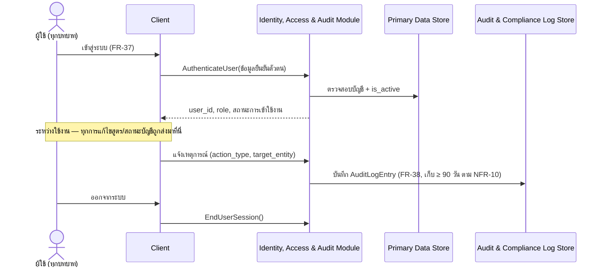
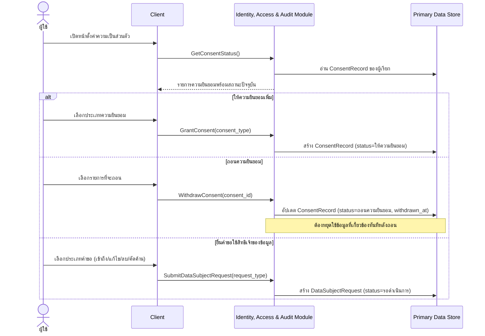
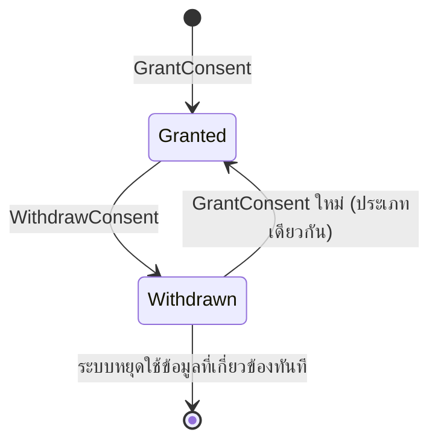
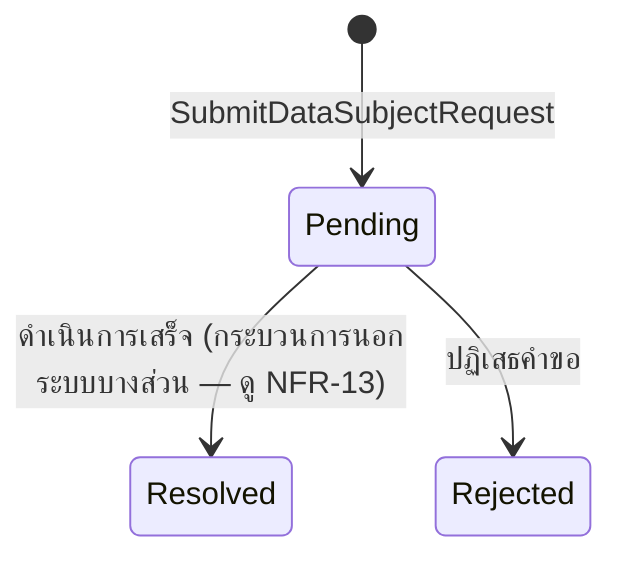

# Detailed Design — F-08 บัญชีผู้ใช้และการกำกับข้อมูล

- **อัปเดตล่าสุด:** 2026-08-28
- **ฟีเจอร์:** [[../../feature-list#F-08 บัญชีผู้ใช้และการกำกับข้อมูล|F-08 บัญชีผู้ใช้และการกำกับข้อมูล]] (FR-37, FR-38, FR-39, NFR-09, NFR-10, NFR-11)
- **ที่มา:** [[../api-spec|API Spec]] §3 โมดูล A + [[../db-spec|DB Spec]] §3.1 + [[../../user-journey#UJ-01 — Journey หลัก: ป้อนสูตรและอ่านผลวิเคราะห์บน Dashboard|UJ-01 ขั้น 1, 16]] + [[../../user-journey#UJ-03 — Journey: จัดการความยินยอมข้อมูลส่วนบุคคล (PDPA)|UJ-03]]
- **ระดับเอกสาร:** Conceptual — ไม่ผูก tech stack

---

## 1. Sequence Diagram

### 1.1 เข้าสู่ระบบ + Audit Log (ส่วนที่ใช้ร่วมกับทุก journey)

### 1.2 จัดการความยินยอม PDPA (UJ-03)

## 2. Operation ↔ Entity ที่กระทบ

| Operation | Entity ที่กระทบ | การกระทำ | ลำดับก่อน-หลัง |
|---|---|---|---|
| `AuthenticateUser` | `User` | อ่าน (ตรวจ `is_active`) | ต้องมาก่อน operation อื่นทั้งหมดในระบบ |
| `EndUserSession` | — | ไม่มี entity | ต้องมี session ที่ใช้งานอยู่ก่อน |
| `GetOwnAuditLog` | `AuditLogEntry` | อ่าน (กรองด้วย `user_ref` ของผู้เรียกเท่านั้น) | — |
| `GetConsentStatus` | `ConsentRecord` | อ่าน | — |
| `GrantConsent` | `ConsentRecord` | สร้าง | — |
| `WithdrawConsent` | `ConsentRecord` | แก้ไข (`status`, `withdrawn_at`) | ต้องมี `ConsentRecord` เดิมอยู่ก่อน |
| `SubmitDataSubjectRequest` | `DataSubjectRequest` | สร้าง | — |
| ทุก operation ที่มีผลข้างเคียง (แก้สูตร/บัญชี/ความยินยอม) | `AuditLogEntry` | สร้าง (บันทึกทุก event) | เกิดขึ้น**หลัง**การกระทำหลักสำเร็จเสมอ |

## 3. State Diagram

### 3.1 `ConsentRecord.status`

### 3.2 `DataSubjectRequest.status`

## 4. Edge Case และวิธีจัดการ

| # | สถานการณ์ | พฤติกรรมที่ต้องเกิด | อ้างอิง |
|---|---|---|---|
| 1 | ผู้ใช้ A ล็อกอิน | ต้องเห็นเฉพาะสูตรของผู้ใช้ A เท่านั้น ห้ามเข้าถึงสูตรของผู้ใช้ B ไม่ว่าด้วยวิธีใด | AC-08.1, NFR-09 |
| 2 | ข้อมูลยืนยันตัวตนไม่ถูกต้อง หรือบัญชีถูกปิดใช้งาน (`is_active=เท็จ`) | `AuthenticateUser` ปฏิเสธ | [[../api-spec#3. โมดูล A — Identity, Access & Consent (F-08 / FR-37–39 / NFR-09,10,11)|api-spec.md §3]] |
| 3 | ผู้ใช้แก้ไขสัดส่วนของสูตรแล้วบันทึก | Audit Log ต้องบันทึกผู้แก้ไข สิ่งที่เปลี่ยน และวันเวลา เก็บไว้อย่างน้อย 90 วัน | AC-08.2, NFR-10 |
| 4 | ผู้ใช้เข้าใช้งานครั้งแรก | ต้องแสดงคำขอความยินยอมพร้อมระบุว่าจะเก็บข้อมูลอะไรและใช้ทำอะไรก่อนขอ | AC-08.3 |
| 5 | ผู้ใช้ถอนความยินยอมที่เคยให้ | ระบบต้องหยุดใช้ข้อมูลที่เกี่ยวข้องทันที ไม่ใช่แค่บันทึกสถานะเฉยๆ | AC-08.3 |
| 6 | `consent_type`/`request_type` ที่ไม่รู้จัก | `GrantConsent`/`SubmitDataSubjectRequest` ปฏิเสธ | api-spec.md §3 |
| 7 | `WithdrawConsent` ด้วย `consent_id` ที่ไม่ใช่ของผู้เรียก | ปฏิเสธ | api-spec.md §3 |
| 8 | `ListOrganizationFormulas` ถูกเรียกโดย Formulation Manager | IAM ต้องยืนยัน `organization_ref` ก่อนส่งต่อให้ Formula Management Module เสมอ — F-19 (Should have) ยังไม่มี detailed-design แยกในรอบ MVP นี้ แต่ใช้ IAM component เดียวกันกับที่อธิบายไว้ในเอกสารนี้ | FR-42, BR-08 |

## 5. เอกสารที่เกี่ยวข้อง

- [[../api-spec|API Spec]] §3 โมดูล A
- [[../db-spec|DB Spec]] §3.1
- [[../../feature-list|Feature List]]
- [[../../user-journey|User Journey]] UJ-01, UJ-03
- [[../../../03-testing/01-test-plan/acceptance-criteria|Acceptance Criteria]] AC-08.1–AC-08.3
