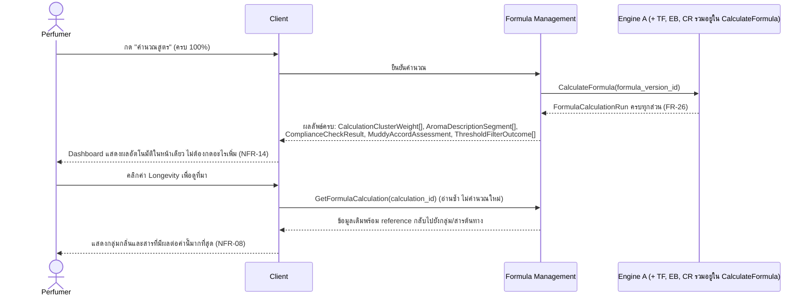

# Detailed Design — F-07 Dashboard สรุปผลสูตร

- **อัปเดตล่าสุด:** 2026-08-28
- **ฟีเจอร์:** [[../../feature-list#F-07 Dashboard สรุปผลสูตร|F-07 Dashboard สรุปผลสูตร]] (FR-26, FR-27, NFR-08, NFR-14)
- **ที่มา:** [[../api-spec|API Spec]] §5 โมดูล C (CalculateFormula, GetFormulaCalculation) + [[../db-spec|DB Spec]] §3.4–§3.6 + [[../../user-journey#UJ-01 — Journey หลัก: ป้อนสูตรและอ่านผลวิเคราะห์บน Dashboard|UJ-01 ขั้น 14–15]]
- **ระดับเอกสาร:** Conceptual — ไม่ผูก tech stack
- **ชื่อไฟล์ตรงกับ Test Case:** [[../../../03-testing/01-test-plan/test-cases/dashboard-aroma-profile|test-cases/dashboard-aroma-profile]] (ฟีเจอร์เดียวกันที่เลือกทำ Prototype + Test Spec ให้ครบสาย)

---

## 1. Sequence Diagram

## 2. Operation ↔ Entity ที่กระทบ

| Operation | Entity ที่กระทบ | การกระทำ | ลำดับก่อน-หลัง |
|---|---|---|---|
| `CalculateFormula` | `FormulaCalculationRun` และ entity ลูกทั้งหมด (ดู [[engine-a-calculation|F-02]], [[olfactory-threshold-filter|F-03]], [[engine-b-aroma-description|F-04]], [[ifra-compliance-check|F-05]], [[muddy-accord-detection|F-06]]) | อ่าน (Dashboard เป็นแค่ชั้นรวมผลแสดงผล ไม่สร้าง entity ใหม่ของตัวเอง) | ต้องรอทุก component ย่อยคำนวณเสร็จก่อน |
| `GetFormulaCalculation` | เหมือนข้างต้น | อ่านอย่างเดียว (สำหรับเปิด Dashboard ของการคำนวณที่มีอยู่แล้วซ้ำ เช่น ตอนคลิกดูที่มา) | ต้องมี `FormulaCalculationRun` จาก `CalculateFormula` มาก่อน |

## 3. State Transition

ไม่มี state diagram — Dashboard เป็นชั้นแสดงผลรวม (aggregation/view layer) ไม่ได้ถือ state ของตัวเอง สถานะทั้งหมดที่แสดงมาจาก entity ที่ component อื่นสร้างไว้แล้ว (ดู state diagram ของ F-05 สำหรับสถานะ Compliance ที่ Dashboard นำมาแสดง)

## 4. Edge Case และวิธีจัดการ

| # | สถานการณ์ | พฤติกรรมที่ต้องเกิด | อ้างอิง |
|---|---|---|---|
| 1 | คำนวณเสร็จแล้ว | ต้องแสดงครบทั้ง 5 ส่วนทันทีโดยผู้ใช้ไม่ต้องกดอะไรเพิ่ม: คำบรรยายกลิ่น, พีระมิดกลิ่น, สถานะ IFRA, Longevity/Sillage, คำเตือนความเสี่ยง | AC-07.1 |
| 2 | แสดงพีระมิดกลิ่น | ต้องครบทั้ง 3 ชั้น เรียงตาม % จากมากไปน้อยในแต่ละชั้น พร้อมระบุ % กำกับ | AC-07.2 |
| 3 | เปิด Dashboard บนหน้าจอความละเอียด 1440×900 | คำบรรยายกลิ่น, สถานะ IFRA, คำเตือนความเสี่ยง ต้องมองเห็นครบโดยไม่ต้องเลื่อนจอ | AC-07.3, NFR-14 |
| 4 | ผู้ใช้คลิกค่าใดก็ตามบน Dashboard (เช่น Longevity) | ต้องแสดงที่มาของการคำนวณ — กลุ่มกลิ่น/สารที่มีผลต่อค่านั้นมากที่สุด สาวกลับไปยัง entity ต้นทางได้เสมอ | AC-07.4, NFR-08 |
| 5 | บาง component ย่อย (เช่น Engine B) fallback เป็นตัวเลขดิบ (`is_fallback=จริง`) | Dashboard ต้องยังแสดงผลได้ครบ ไม่ปล่อยให้ส่วนนั้นว่างเปล่า — แสดงตัวเลขดิบแทนคำบรรยายตามที่ Engine B ส่งมา | NFR-13, [[engine-b-aroma-description|Detailed Design F-04]] |

## 5. เอกสารที่เกี่ยวข้อง

- [[../api-spec|API Spec]] §5 โมดูล C
- [[../db-spec|DB Spec]] §3.4–§3.6
- [[../../feature-list|Feature List]]
- [[../../user-journey|User Journey]] UJ-01
- [[../../../03-testing/01-test-plan/acceptance-criteria|Acceptance Criteria]] AC-07.1–AC-07.4
- [[../../../03-testing/01-test-plan/test-cases/dashboard-aroma-profile|Test Cases]]
- [[../../01-prototypes/20260818-01-v1/prototype|Prototype v1]]
