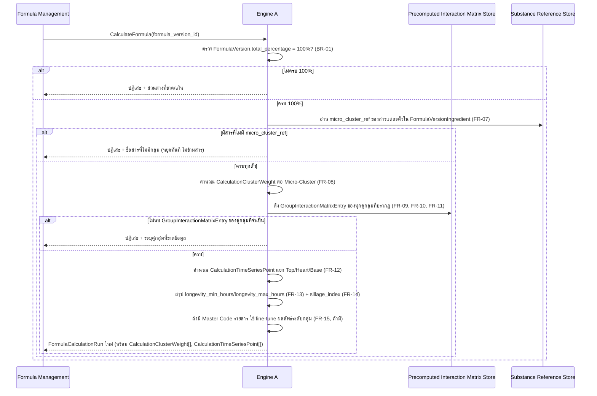

# Detailed Design — F-02 Engine A — เครื่องคำนวณฟิสิกส์เคมี

- **อัปเดตล่าสุด:** 2026-08-28
- **ฟีเจอร์:** [[../../feature-list#F-02 Engine A — เครื่องคำนวณฟิสิกส์เคมี|F-02 Engine A]] (FR-07 – FR-14, NFR-01, NFR-03)
- **ที่มา:** [[../api-spec|API Spec]] §5 โมดูล C (CalculateFormula) + [[../db-spec|DB Spec]] §3.3, §3.4 + [[../../user-journey#UJ-01 — Journey หลัก: ป้อนสูตรและอ่านผลวิเคราะห์บน Dashboard|UJ-01 ขั้น 8–10]]
- **ระดับเอกสาร:** Conceptual — ไม่ผูก tech stack

---

## 1. Sequence Diagram

## 2. Operation ↔ Entity ที่กระทบ

| Operation | Entity ที่กระทบ | การกระทำ | ลำดับก่อน-หลัง |
|---|---|---|---|
| `CalculateFormula` | `FormulaCalculationRun` | สร้างใหม่ทุกครั้ง (ไม่เขียนทับ — รองรับ NFR-08/NFR-03) | ต้องมี `FormulaVersion.total_percentage = 100%` ก่อนเสมอ (BR-01) |
| `CalculateFormula` | `CalculationClusterWeight` | สร้าง (1 แถวต่อ Micro-Cluster ที่ปรากฏในสูตร) | หลังระบุ micro_cluster_ref ของทุกสารสำเร็จ |
| `CalculateFormula` | `CalculationTimeSeriesPoint` | สร้าง (1 แถวต่อสาร ต่อจุดเวลา) | หลังดึง `GroupInteractionMatrixEntry` ครบ |
| `CalculateFormula` | `GroupInteractionMatrixEntry` | อ่านอย่างเดียว | ต้องมีอยู่ล่วงหน้า (precomputed) |
| `CalculateFormula` | `Substance` | อ่าน `micro_cluster_ref`, Master Code | อ่านอย่างเดียว |
| `GetFormulaCalculation` | `FormulaCalculationRun` และ entity ลูกทั้งหมด | อ่านอย่างเดียว (ไม่คำนวณใหม่) | ต้องมี `FormulaCalculationRun` จาก `CalculateFormula` มาก่อนแล้ว |

## 3. State Transition

ไม่มี state diagram สำหรับ component นี้ — `FormulaCalculationRun` เป็น **immutable snapshot ที่สร้างครั้งเดียวไม่เปลี่ยนสถานะภายหลัง** (ดู [[../db-spec#3.4 ผลการคำนวณ Engine A + Threshold Filter (F-02, F-03 / FR-08, FR-12–14, FR-16–17 / NFR-01, NFR-03, NFR-08)|db-spec.md §3.4]]) การเรียกคำนวณซ้ำของ `FormulaVersion` เดิมสร้างแถวใหม่เสมอ ไม่ใช่การเปลี่ยนสถานะของแถวเดิม — คุณสมบัติ deterministic (NFR-03) หมายถึง "แถวใหม่ที่สร้างจาก input เดิมต้องมีค่าตัวเลขเหมือนแถวก่อนหน้าทุกตัว" ไม่ใช่ state machine

## 4. Edge Case และวิธีจัดการ

| # | สถานการณ์ | พฤติกรรมที่ต้องเกิด | อ้างอิง |
|---|---|---|---|
| 1 | `FormulaVersion.total_percentage ≠ 100%` | ปฏิเสธการคำนวณทั้งหมด พร้อมคืนส่วนต่างที่ขาด/เกินให้ผู้เรียกแสดงผล ไม่ใช่ error ทั่วไป | BR-01, [[../api-spec#5. โมดูล C — Core Calculation Pipeline (F-02, F-03, F-04, F-05, F-06 / FR-07–27 / NFR-01,02,03,08,12,13)|api-spec.md §5]] |
| 2 | มีสารที่ไม่มี `micro_cluster_ref` | หยุดการคำนวณทั้งสูตรทันที แจ้งชื่อสารนั้น **ห้ามคำนวณต่อแบบข้ามสาร** | AC-02.1 |
| 3 | ไม่พบ `GroupInteractionMatrixEntry` ของคู่กลุ่มที่จำเป็น | ปฏิเสธพร้อมระบุคู่กลุ่มที่ขาดข้อมูล | api-spec.md §5 CalculateFormula |
| 4 | เรียกคำนวณซ้ำด้วย `formula_version_id` เดิมที่ไม่มีการแก้ไข | ผลลัพธ์ทุกตัวเลขต้องเหมือนเดิมทุกครั้ง ห้ามมีองค์ประกอบสุ่ม | AC-02.2, NFR-03 |
| 5 | สูตรมีสาร 50–80 ตัว | ต้องคืนผลลัพธ์ครบทุกส่วนภายใน 500 มิลลิวินาที โดยใช้ค่าที่ precompute ไว้ล่วงหน้าในระดับกลุ่มแทนการคำนวณคู่สารแบบสด | AC-02.4, NFR-01 |
| 6 | สารมี Master Code ครบ (MW, Vapor Pressure, LogP, Receptor tag) | ใช้ fine-tune ผลลัพธ์ระดับกลุ่มให้ละเอียดขึ้น (F-09/FR-15 — Should have ไม่ใช่ MVP บังคับ) — ถ้าไม่มี ระบบยังต้องคำนวณผลระดับกลุ่มได้ตามปกติ | [[../../feature-list#F-09 Fine-tune ระดับรายสาร|feature-list F-09]] |

## 5. เอกสารที่เกี่ยวข้อง

- [[../api-spec|API Spec]] §5 โมดูล C
- [[../db-spec|DB Spec]] §3.3, §3.4
- [[../../feature-list|Feature List]]
- [[../../user-journey|User Journey]] UJ-01
- [[../../../03-testing/01-test-plan/acceptance-criteria|Acceptance Criteria]] AC-02.1–AC-02.4
