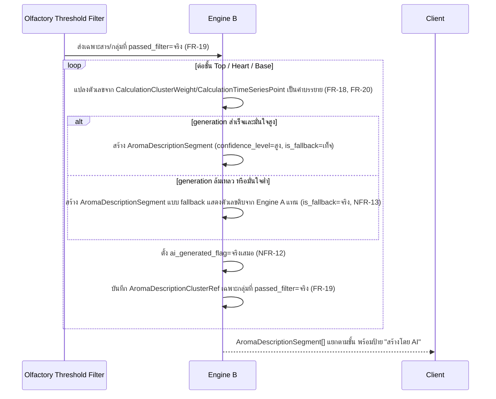

# Detailed Design — F-04 Engine B — บรีฟบรรยายกลิ่นอัตโนมัติ

- **อัปเดตล่าสุด:** 2026-08-28
- **ฟีเจอร์:** [[../../feature-list#F-04 Engine B — บรีฟบรรยายกลิ่นอัตโนมัติ|F-04 Engine B]] (FR-18, FR-19, FR-20, NFR-12, NFR-13)
- **ที่มา:** [[../api-spec|API Spec]] §5 โมดูล C (ส่วนหนึ่งของ CalculateFormula) + [[../db-spec|DB Spec]] §3.5 + [[../../user-journey#UJ-01 — Journey หลัก: ป้อนสูตรและอ่านผลวิเคราะห์บน Dashboard|UJ-01 ขั้น 12]]
- **ระดับเอกสาร:** Conceptual — ไม่ผูก tech stack

---

## 1. Sequence Diagram

## 2. Operation ↔ Entity ที่กระทบ

| Operation | Entity ที่กระทบ | การกระทำ | ลำดับก่อน-หลัง |
|---|---|---|---|
| `CalculateFormula` (ส่วน Engine B) | `AromaDescriptionSegment` | สร้าง (1 แถวต่อชั้น Top/Heart/Base) | หลัง Threshold Filter กรองเสร็จเท่านั้น |
| `CalculateFormula` (ส่วน Engine B) | `AromaDescriptionClusterRef` | สร้าง (join ไปยัง `MicroCluster` ที่ผ่านเกณฑ์) | ต้องอ้างเฉพาะกลุ่มที่ `ThresholdFilterOutcome.passed_filter=จริง` |
| `CalculateFormula` (ส่วน Engine B) | `CalculationClusterWeight`, `CalculationTimeSeriesPoint` (จาก Engine A) | อ่านอย่างเดียว | ห้ามเขียนกลับไปแก้ค่าเหล่านี้เด็ดขาด (BR-05) |

## 3. State Transition

ไม่มี state diagram — `AromaDescriptionSegment` เป็นผลลัพธ์ครั้งเดียวต่อ `FormulaCalculationRun` หนึ่งครั้ง มีเพียง 2 สาขาคงที่ (`is_fallback=จริง`/`เท็จ`) ที่ตัดสินตอนสร้างเท่านั้น ไม่ใช่ state ที่เปลี่ยนภายหลัง

## 4. Edge Case และวิธีจัดการ

| # | สถานการณ์ | พฤติกรรมที่ต้องเกิด | อ้างอิง |
|---|---|---|---|
| 1 | Engine A คำนวณ Top/Heart/Base เสร็จแล้ว | ต้องแสดงคำบรรยายแยกครบ 3 ชั้น แต่ละชั้นระบุชื่อกลุ่มกลิ่น + % จาก Engine A | AC-04.1 |
| 2 | ตัวเลขใดๆ ที่ปรากฏในคำบรรยาย | ต้องตรงกับค่าที่ Engine A ส่งมาเป๊ะทุกตัว **ห้ามมีตัวเลขที่ไม่ปรากฏใน output ของ Engine A** — นี่คือกลไกกัน Hallucination หลักของระบบ | AC-04.2, BR-05 |
| 3 | สารที่ถูก Threshold Filter ตัดออก (`passed_filter=เท็จ`) | ห้ามถูกกล่าวถึงในคำบรรยายหรือ `AromaDescriptionClusterRef` โดยเด็ดขาด | AC-04.2, FR-19 |
| 4 | ทุกครั้งที่แสดงคำบรรยายบน Dashboard | ต้องมีข้อความกำกับชัดเจนว่าสร้างโดย AI และต้องผ่านการยืนยันจากนักปรุงก่อนใช้จริง | AC-04.3, NFR-12 |
| 5 | Generation ล้มเหลว หรือความมั่นใจต่ำ | Fallback เป็นการแสดงตัวเลขดิบจาก Engine A แทนคำบรรยาย (`is_fallback=จริง`) — ไม่ใช่ปล่อยให้หน้าจอว่างเปล่าหรือค้าง | NFR-13 |

## 5. เอกสารที่เกี่ยวข้อง

- [[../api-spec|API Spec]] §5 โมดูล C
- [[../db-spec|DB Spec]] §3.5
- [[../../feature-list|Feature List]]
- [[../../user-journey|User Journey]] UJ-01
- [[../../../03-testing/01-test-plan/acceptance-criteria|Acceptance Criteria]] AC-04.1–AC-04.3
- [[olfactory-threshold-filter|Detailed Design F-03]] — ต้นทางของรายการสาร/กลุ่มที่ Engine B มีสิทธิ์อ้างถึง
