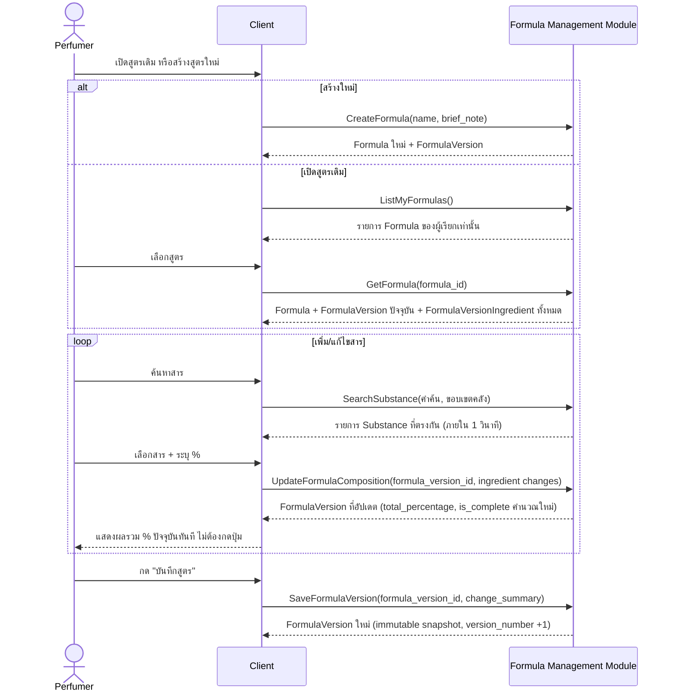
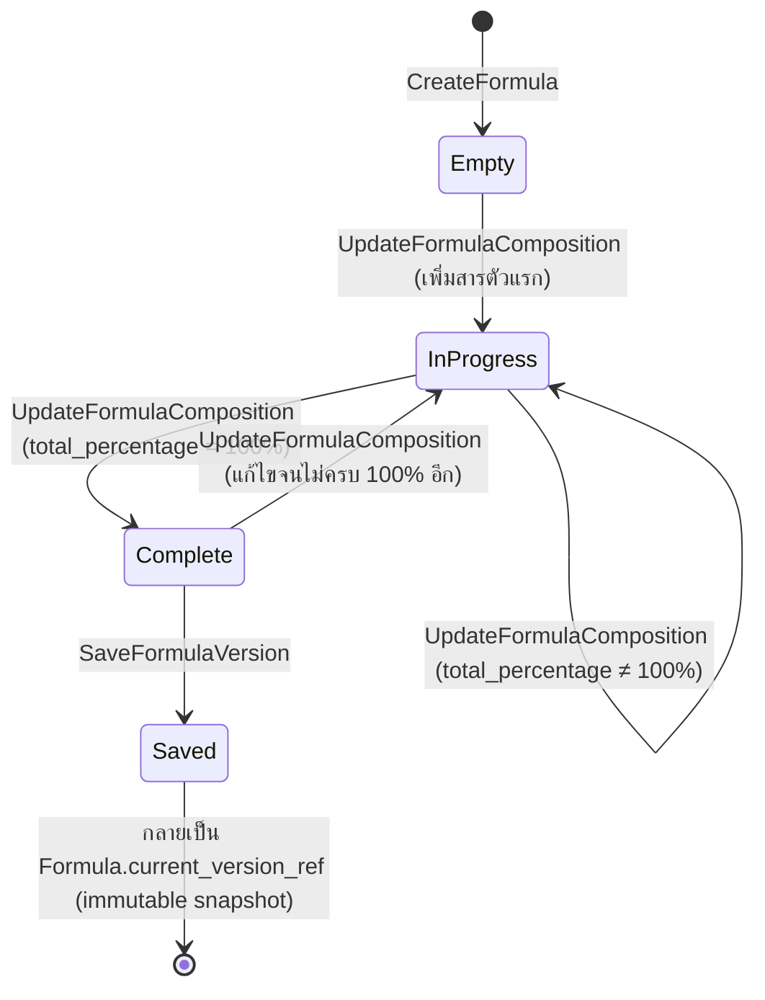

# Detailed Design — F-01 การจัดการสูตรน้ำหอม

- **อัปเดตล่าสุด:** 2026-08-28
- **ฟีเจอร์:** [[../../feature-list#F-01 การจัดการสูตรน้ำหอม|F-01 การจัดการสูตรน้ำหอม]] (FR-01, FR-02, FR-03, FR-04)
- **ที่มา:** [[../api-spec|API Spec]] โมดูล B + [[../db-spec|DB Spec]] §3.2, §3.3 + [[../../user-journey#UJ-01 — Journey หลัก: ป้อนสูตรและอ่านผลวิเคราะห์บน Dashboard|UJ-01 ขั้น 2–7]]
- **ระดับเอกสาร:** Conceptual — อ้างอิงเฉพาะ operation/entity ที่มีอยู่จริงใน api-spec.md/db-spec.md ไม่ผูก tech stack

---

## 1. Sequence Diagram

> **หมายเหตุ:** การตรวจสถานะ Regulatory Limit ของสารก่อนเพิ่มเข้าสูตร (FR-40, FR-41) เป็นขั้นตอนที่แทรกอยู่ระหว่าง "เลือกสาร" กับ "ระบุ %" ในไดอะแกรมนี้ — รายละเอียดเต็มอยู่ที่ [[prohibited-substance-guard|Detailed Design F-18]] เพื่อไม่ให้ไดอะแกรมนี้ซ้ำซ้อน

## 2. Operation ↔ Entity ที่กระทบ

| Operation | Entity ที่กระทบ | การกระทำ | ลำดับก่อน-หลัง |
|---|---|---|---|
| `CreateFormula` | `Formula`, `FormulaVersion` | สร้าง | ต้องมาก่อน operation อื่นทั้งหมดของสูตรนั้น |
| `ListMyFormulas` | `Formula` | อ่าน (กรองด้วย `owner_ref`) | — |
| `GetFormula` | `Formula`, `FormulaVersion`, `FormulaVersionIngredient` | อ่าน | ต้องมี `CreateFormula` มาก่อน |
| `SearchSubstance` | `Substance` | อ่าน | ไม่ขึ้นกับสูตรใด |
| `UpdateFormulaComposition` | `FormulaVersionIngredient` | สร้าง/แก้ไข/ลบ | ต้องมี `FormulaVersion` (จาก `CreateFormula` หรือเปิดสูตรเดิม) อยู่ก่อน |
| `SaveFormulaVersion` | `FormulaVersion` | สร้างเวอร์ชันใหม่ (immutable) | ต้องมาหลัง `UpdateFormulaComposition` อย่างน้อย 1 ครั้ง |

## 3. State Diagram — สถานะของ FormulaVersion

> `is_complete` ของ `FormulaVersion` สะท้อนแค่สถานะ `InProgress`/`Complete` — ไม่ใช่ flag แยกที่ต้องมี attribute เพิ่ม (ดู [[../db-spec#3.2 การจัดการสูตร (F-01, F-15, F-16 / FR-01–06)|db-spec.md §3.2]]) ส่วนสถานะ `Saved` คือผลลัพธ์ของการเรียก `SaveFormulaVersion` ที่สร้างแถวใหม่แบบ immutable ไม่ใช่การเปลี่ยนสถานะแถวเดิม

## 4. Edge Case และวิธีจัดการ

| # | สถานการณ์ | พฤติกรรมที่ต้องเกิด | อ้างอิง |
|---|---|---|---|
| 1 | ผลรวมสัดส่วน < 100% แล้วผู้ใช้พยายามคำนวณ | `UpdateFormulaComposition` ยังบันทึกได้ปกติ (ไม่บังคับ 100% ที่ชั้นนี้) — การบล็อกปุ่ม "คำนวณสูตร" เป็นหน้าที่ของ Client อ่านค่า `is_complete` จาก output แล้วปิดปุ่มเอง พร้อมแสดงส่วนต่างที่ขาด | AC-01.2, [[../api-spec#4. โมดูล B — Formula Management (F-01, F-15, F-16 / FR-01–06)|api-spec §4 UpdateFormulaComposition]] |
| 2 | ผลรวมสัดส่วน > 100% | Client แสดงข้อความ "เกินมา X%" จาก `total_percentage` ที่คืนมา ไม่ใช่ error จาก backend | AC-01.3 |
| 3 | ค้นหาสารด้วยคำที่ไม่มีในคลัง | `SearchSubstance` คืนรายการเปล่า ไม่ใช่ error | [[../api-spec|api-spec.md §4 SearchSubstance]] |
| 4 | เพิ่ม `substance_ref` ที่ไม่มีในคลังกลางหรือคลังส่วนตัวของผู้เรียก | `UpdateFormulaComposition` ปฏิเสธด้วย error ระบุว่าไม่พบสาร | api-spec.md §4 UpdateFormulaComposition |
| 5 | ระบุ `percentage` เป็นค่าลบ | `UpdateFormulaComposition` ปฏิเสธ | api-spec.md §4 UpdateFormulaComposition |
| 6 | เปิดสูตรเดิมที่เคยบันทึกไว้ | `GetFormula` ต้องคืนสารและสัดส่วนครบทุกตัวเหมือนตอนบันทึก ไม่มีตกหล่น | AC-01.5 |
| 7 | ผู้ใช้ A พยายามเรียก `GetFormula`/`UpdateFormulaComposition` ของสูตรที่ `owner_ref` เป็นผู้ใช้ B | ปฏิเสธเสมอ (NFR-09) — ดูรายละเอียดสิทธิ์เต็มที่ [[account-identity-audit-consent|Detailed Design F-08]] | AC-08.1 |

## 5. เอกสารที่เกี่ยวข้อง

- [[../api-spec|API Spec]] §4 โมดูล B
- [[../db-spec|DB Spec]] §3.2, §3.3
- [[../../feature-list|Feature List]]
- [[../../user-journey|User Journey]] UJ-01
- [[../../../03-testing/01-test-plan/acceptance-criteria|Acceptance Criteria]] AC-01.1–AC-01.5
- [[prohibited-substance-guard|Detailed Design F-18]] — กลไกตรวจสารต้องห้ามที่แทรกอยู่ในขั้นตอนเลือกสาร
