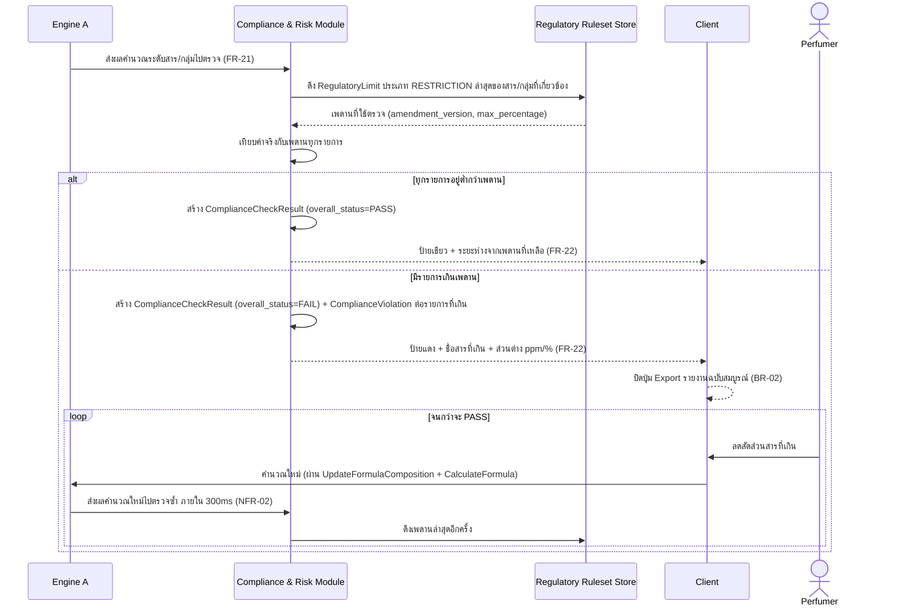
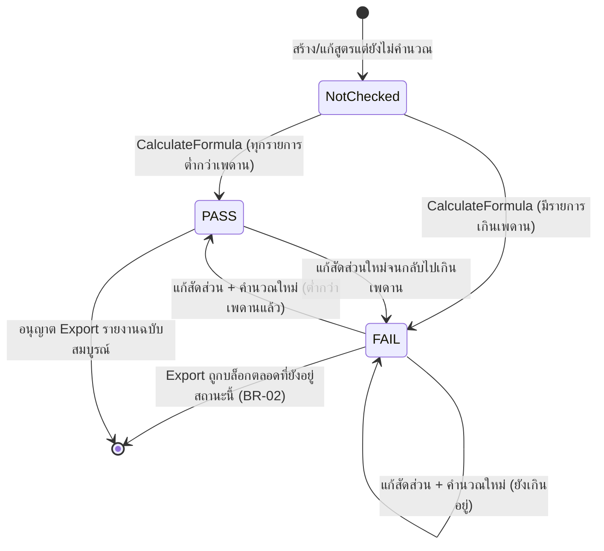

# Detailed Design — F-05 IFRA Compliance Check

- **อัปเดตล่าสุด:** 2026-08-28
- **ฟีเจอร์:** [[../../feature-list#F-05 IFRA Compliance Check|F-05 IFRA Compliance Check]] (FR-21, FR-22, NFR-02)
- **ที่มา:** [[../api-spec|API Spec]] §5 โมดูล C (ส่วนหนึ่งของ CalculateFormula) + §7 โมดูล E (ExportFormulaReport) + [[../db-spec|DB Spec]] §3.6 + [[../../user-journey#UJ-02 — Journey รอง: เจอ IFRA FAIL แล้วแก้สูตรจนผ่าน|UJ-02]]
- **ระดับเอกสาร:** Conceptual — ไม่ผูก tech stack

---

## 1. Sequence Diagram

## 2. Operation ↔ Entity ที่กระทบ

| Operation | Entity ที่กระทบ | การกระทำ | ลำดับก่อน-หลัง |
|---|---|---|---|
| `CalculateFormula` (ส่วน Compliance) | `ComplianceCheckResult` | สร้าง (1 แถวต่อ `FormulaCalculationRun`) | หลัง Engine A คำนวณเสร็จ |
| `CalculateFormula` (ส่วน Compliance) | `ComplianceViolation` | สร้าง (1 แถวต่อรายการที่เกินเพดาน) | เฉพาะเมื่อ `overall_status=FAIL` |
| `CalculateFormula` (ส่วน Compliance) | `RegulatoryLimit` (limit_type=RESTRICTION) | อ่านอย่างเดียว | อ่านทุกครั้งที่ตรวจ ไม่แคชค่าเก่าไว้ใช้ซ้ำ (NFR-07) |
| `ExportFormulaReport` | `ComplianceCheckResult`, `ExportedReport` | อ่าน `ComplianceCheckResult` ล่าสุด แล้วสร้าง/ปฏิเสธ `ExportedReport` | ต้องมี `ComplianceCheckResult` ของ `calculation_id` นั้นอยู่ก่อนเสมอ |

## 3. State Diagram — สถานะ Compliance ที่ผู้ใช้เห็นต่อสูตรหนึ่งสูตร

> หมายเหตุ: แต่ละ transition คือการสร้าง `ComplianceCheckResult` แถวใหม่จาก `FormulaCalculationRun` ใหม่ (ไม่ใช่การแก้ไขแถวเดิม) — Diagram นี้อธิบาย "สถานะที่ผู้ใช้รับรู้ล่าสุด" ไม่ใช่ state ของ entity เดี่ยวๆ

## 4. Edge Case และวิธีจัดการ

| # | สถานการณ์ | พฤติกรรมที่ต้องเกิด | อ้างอิง |
|---|---|---|---|
| 1 | ทุกสารต่ำกว่าเพดาน IFRA | แสดง PASS พร้อมระยะห่างจากเพดานที่เหลือของสารที่ใกล้เพดานที่สุด | AC-05.1 |
| 2 | มีสารเกินเพดาน | แสดง FAIL พร้อมชื่อสารที่เกินและส่วนต่างเป็น ppm หรือ % | AC-05.2 |
| 3 | ผู้ใช้ลดสัดส่วนสารที่เกินจนต่ำกว่าเพดาน | ต้องตรวจซ้ำอัตโนมัติโดยผู้ใช้ไม่ต้องกดคำนวณเอง และเปลี่ยนเป็น PASS ภายใน 300 มิลลิวินาที | AC-05.3, NFR-02 |
| 4 | สถานะ IFRA เป็น FAIL แล้วผู้ใช้กด Export รายงานฉบับสมบูรณ์ | ปุ่มต้องอยู่ในสถานะปิดใช้งาน พร้อมเหตุผลว่าสูตรยังไม่ผ่านเกณฑ์ IFRA — ห้าม Export จนกว่าจะแก้เป็น PASS | AC-05.4, BR-02 |
| 5 | สารที่ถูก Threshold Filter ตัดออกไปแล้ว (F-03) | ยังคงถูกนับในการตรวจ IFRA ตามปกติ ไม่ถูกยกเว้น | BR-03 |
| 6 | สารมีสถานะ Regulatory Limit เป็น PROHIBITION | **ไม่ใช่หน้าที่ของ component นี้** — ถูกบล็อกไปแล้วตั้งแต่จุดเลือกสารโดย Formula Management Module ก่อนจะมาถึงขั้นคำนวณ (ดู [[prohibited-substance-guard|Detailed Design F-18]]) | FR-40, FR-41 |

## 5. เอกสารที่เกี่ยวข้อง

- [[../api-spec|API Spec]] §5 โมดูล C, §7 โมดูล E
- [[../db-spec|DB Spec]] §3.6
- [[../../feature-list|Feature List]]
- [[../../user-journey|User Journey]] UJ-02
- [[../../../03-testing/01-test-plan/acceptance-criteria|Acceptance Criteria]] AC-05.1–AC-05.4
- [[prohibited-substance-guard|Detailed Design F-18]] — กลไก PROHIBITION ที่ทำงานก่อนขั้นตอนนี้เสมอ
