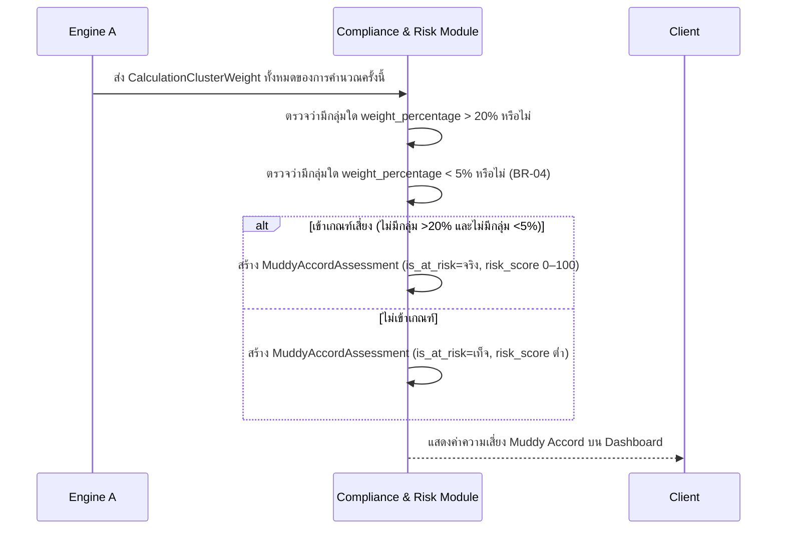

# Detailed Design — F-06 Muddy Accord Detection

- **อัปเดตล่าสุด:** 2026-08-28
- **ฟีเจอร์:** [[../../feature-list#F-06 Muddy Accord Detection|F-06 Muddy Accord Detection]] (FR-23)
- **ที่มา:** [[../api-spec|API Spec]] §5 โมดูล C (ส่วนหนึ่งของ CalculateFormula) + [[../db-spec|DB Spec]] §3.6 + [[../../user-journey#UJ-01 — Journey หลัก: ป้อนสูตรและอ่านผลวิเคราะห์บน Dashboard|UJ-01 ขั้น 13]]
- **ระดับเอกสาร:** Conceptual — ไม่ผูก tech stack
- **ขอบเขต:** เอกสารนี้ครอบคลุมเฉพาะการ**ตรวจจับ** (FR-23, MVP) ส่วนการ**แนะนำวิธีแก้** (FR-24) เป็นฟีเจอร์ [[../../feature-list#F-10 คำแนะนำแก้ไขและเตือน Scent Drift|F-10 — Should have]] ที่ยังไม่อยู่ในขอบเขต MVP รอบนี้ แม้ entity `MuddyAccordRecommendation` จะออกแบบไว้ล่วงหน้าใน db-spec.md แล้วก็ตาม

---

## 1. Sequence Diagram

## 2. Operation ↔ Entity ที่กระทบ

| Operation | Entity ที่กระทบ | การกระทำ | ลำดับก่อน-หลัง |
|---|---|---|---|
| `CalculateFormula` (ส่วน Muddy Accord) | `MuddyAccordAssessment` | สร้าง (1 แถวต่อ `FormulaCalculationRun`) | หลัง Engine A สร้าง `CalculationClusterWeight` ครบทุกกลุ่มแล้ว |
| `CalculateFormula` (ส่วน Muddy Accord) | `CalculationClusterWeight` | อ่านอย่างเดียว | อ่านทุกกลุ่มที่ปรากฏในการคำนวณครั้งนี้ |

## 3. State Transition

ไม่มี state diagram — `MuddyAccordAssessment` เป็นผลลัพธ์ครั้งเดียวต่อ `FormulaCalculationRun` หนึ่งครั้ง (immutable) เหมือน `ComplianceCheckResult` ในฟีเจอร์ F-05

## 4. Edge Case และวิธีจัดการ

| # | สถานการณ์ | พฤติกรรมที่ต้องเกิด | อ้างอิง |
|---|---|---|---|
| 1 | ไม่มีกลุ่มใดมีสัดส่วนสูงกว่า 20% **และ**ไม่มีกลุ่มใดต่ำกว่า 5% | ต้องแจ้งเตือน Muddy Accord Risk พร้อมค่าความเสี่ยงในช่วง 0–100% | AC-06.1, BR-04 |
| 2 | มีกลุ่มหนึ่งสัดส่วน 35% และอีกกลุ่ม 3% (มีทั้งกลุ่มสูงและกลุ่มต่ำ) | ต้อง**ไม่**แจ้งเตือน Muddy Accord — ค่าความเสี่ยงที่แสดงต้องอยู่ในระดับต่ำ | AC-06.2, BR-04 |
| 3 | สูตรมีเพียง 1 Micro-Cluster เดียว (edge case ที่สเปกไม่ได้ระบุไว้ตรงๆ) | ยึดกติกา BR-04 ตามตัวอักษร — ถ้ากลุ่มเดียวมี weight 100% (>20% และไม่มีกลุ่มใด <5%) ถือว่า**ไม่เข้าเกณฑ์เสี่ยง** เพราะเงื่อนไข "ไม่มีกลุ่มใด >20%" ไม่เป็นจริง | ตีความจาก BR-04 ตรงตัว — ถ้าพบว่าไม่ตรงกับความคาดหวังทางธุรกิจจริง ให้รัน `sync-api-db` ทบทวน BR-04 ก่อนพัฒนา |

## 5. เอกสารที่เกี่ยวข้อง

- [[../api-spec|API Spec]] §5 โมดูล C
- [[../db-spec|DB Spec]] §3.6
- [[../../feature-list|Feature List]]
- [[../../user-journey|User Journey]] UJ-01
- [[../../../03-testing/01-test-plan/acceptance-criteria|Acceptance Criteria]] AC-06.1, AC-06.2
