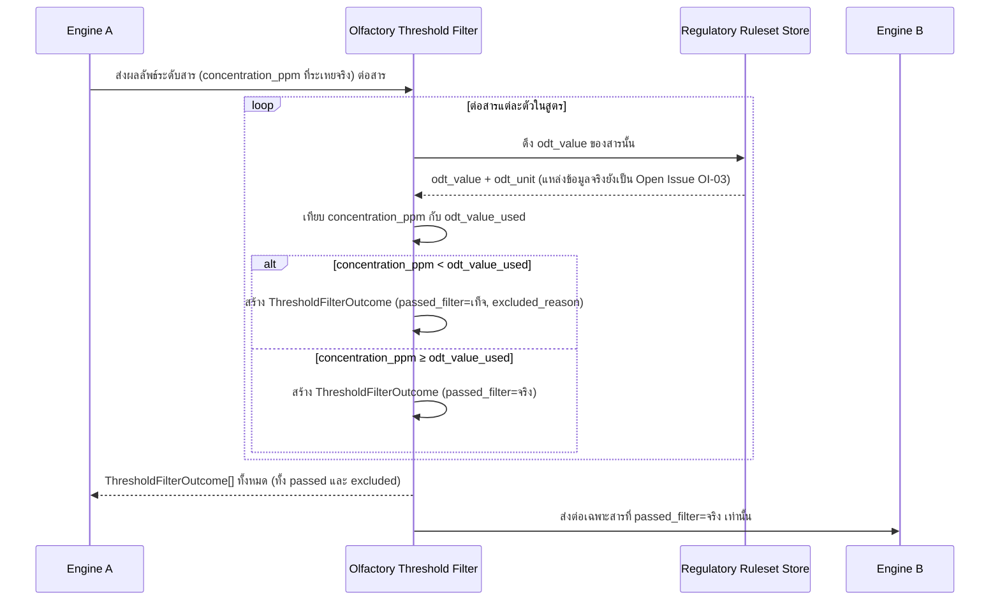

# Detailed Design — F-03 Olfactory Threshold Filter

- **อัปเดตล่าสุด:** 2026-08-28
- **ฟีเจอร์:** [[../../feature-list#F-03 Olfactory Threshold Filter|F-03 Olfactory Threshold Filter]] (FR-16, FR-17)
- **ที่มา:** [[../api-spec|API Spec]] §5 โมดูล C (ส่วนหนึ่งของ CalculateFormula) + [[../db-spec|DB Spec]] §3.4 + [[../../user-journey#UJ-01 — Journey หลัก: ป้อนสูตรและอ่านผลวิเคราะห์บน Dashboard|UJ-01 ขั้น 11]]
- **ระดับเอกสาร:** Conceptual — ไม่ผูก tech stack

---

## 1. Sequence Diagram

## 2. Operation ↔ Entity ที่กระทบ

| Operation | Entity ที่กระทบ | การกระทำ | ลำดับก่อน-หลัง |
|---|---|---|---|
| `CalculateFormula` (ส่วน Threshold Filter) | `ThresholdFilterOutcome` | สร้าง (1 แถวต่อสารในสูตร ไม่ว่าจะผ่านหรือถูกตัด) | หลัง Engine A คำนวณ `concentration_ppm` เสร็จ, ก่อนส่งต่อให้ Engine B |
| `CalculateFormula` (ส่วน Threshold Filter) | `RegulatoryLimit`/`Substance.odt_value` | อ่านอย่างเดียว | อ่านต่อสารแต่ละตัว |

## 3. State Transition

ไม่มี state diagram — `ThresholdFilterOutcome` เป็นผลลัพธ์ครั้งเดียวต่อ `FormulaCalculationRun` หนึ่งครั้ง (immutable) ไม่มีการเปลี่ยนสถานะภายหลัง

## 4. Edge Case และวิธีจัดการ

| # | สถานการณ์ | พฤติกรรมที่ต้องเกิด | อ้างอิง |
|---|---|---|---|
| 1 | สารมี `concentration_ppm` ต่ำกว่าค่า ODT | ตัดสารนั้นออกจากคำบรรยายกลิ่นที่ส่งให้ Engine B โดยสิ้นเชิง (ไม่ปรากฏแม้แต่ชื่อ) | AC-03.1 |
| 2 | มีสารถูกตัดออกจากบรีฟ | ต้องแสดงรายการสารที่ถูกตัดทั้งหมดให้ผู้ใช้เห็นบน Dashboard พร้อมค่า ppm ที่คำนวณได้เทียบกับเกณฑ์ ODT — **ห้ามซ่อนข้อมูลนี้** เพราะเป็นต้นทุนที่ผู้ใช้จ่ายไปเปล่าๆ (NFR-08 Explainability) | AC-03.2 |
| 3 | สารที่ถูกตัดออกจากบรีฟ | **ยังคงถูกนับ**ในการตรวจ IFRA (`ComplianceCheckResult`/`ComplianceViolation`) และการคำนวณต้นทุน (`CostBreakdownEntry`) ตามปกติ — ไม่ใช่ถูกลบออกจากสูตรจริง มีแค่ flag `passed_filter=เท็จ` | BR-03, AC-03.2 |
| 4 | แหล่งข้อมูล ODT รายสารยังไม่ระบุแหล่งจริง | เอกสารนี้ออกแบบ contract ไว้ล่วงหน้า (`odt_value`, `odt_unit`) แต่ค่าจริง/แหล่งข้อมูลยังเป็น Open Issue — ไม่บล็อกการออกแบบชั้นนี้ | OI-03 (spec §9) |

## 5. เอกสารที่เกี่ยวข้อง

- [[../api-spec|API Spec]] §5 โมดูล C
- [[../db-spec|DB Spec]] §3.4
- [[../../feature-list|Feature List]]
- [[../../user-journey|User Journey]] UJ-01
- [[../../../03-testing/01-test-plan/acceptance-criteria|Acceptance Criteria]] AC-03.1, AC-03.2
- [[engine-a-calculation|Detailed Design F-02]] — ต้นทางของ `concentration_ppm` ที่ filter นี้ใช้เปรียบเทียบ
