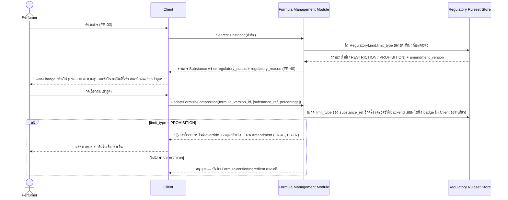
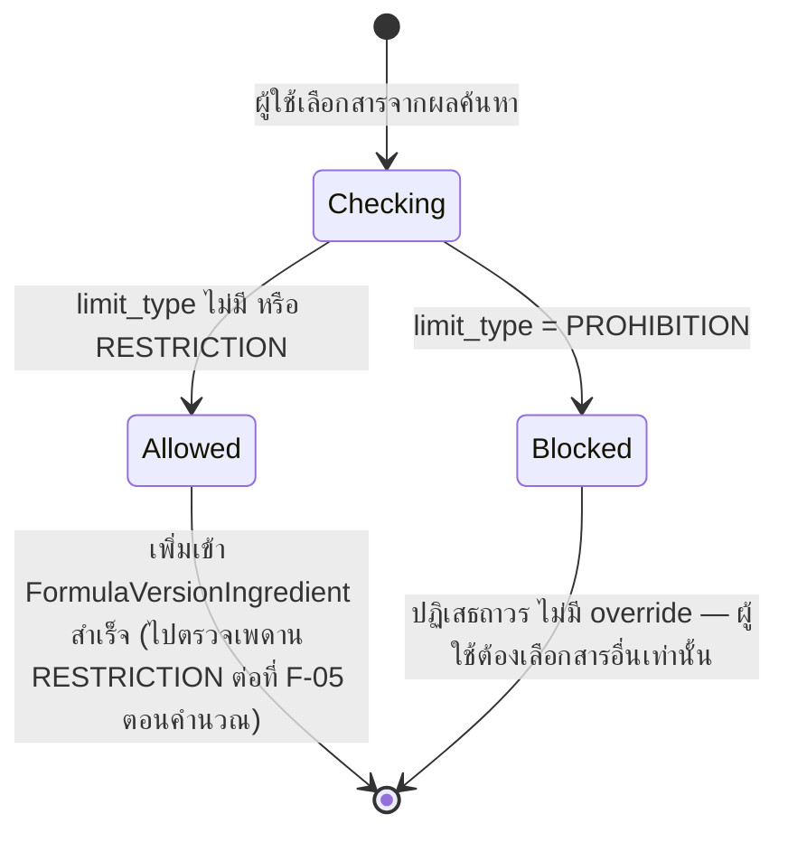

# Detailed Design — F-18 การป้องกันสารต้องห้าม (Prohibited Substance Guard)

- **อัปเดตล่าสุด:** 2026-08-28
- **ฟีเจอร์:** [[../../feature-list#F-18 การป้องกันสารต้องห้าม (Prohibited Substance Guard)|F-18 Prohibited Substance Guard]] (FR-40, FR-41)
- **ที่มา:** [[../api-spec|API Spec]] §4 โมดูล B (SearchSubstance, UpdateFormulaComposition) + [[../db-spec|DB Spec]] §3.6 (RegulatoryLimit) + [[../../user-journey#UJ-01 — Journey หลัก: ป้อนสูตรและอ่านผลวิเคราะห์บน Dashboard|UJ-01 ขั้น 3–5]] + [[../../01-requirements/01-spec/20260818-02-prohibited-substance-blocking|Prohibited Substance Blocking Spec]]
- **ระดับเอกสาร:** Conceptual — ไม่ผูก tech stack

---

## 1. Sequence Diagram

## 2. Operation ↔ Entity ที่กระทบ

| Operation | Entity ที่กระทบ | การกระทำ | ลำดับก่อน-หลัง |
|---|---|---|---|
| `SearchSubstance` | `Substance`, `RegulatoryLimit` | อ่าน (join สถานะ regulatory ต่อสารที่ค้นเจอ) | เกิดก่อนที่ผู้ใช้จะเลือกสารใดๆ เข้าสูตร |
| `UpdateFormulaComposition` | `RegulatoryLimit` | อ่าน (ตรวจซ้ำที่ backend ก่อนบันทึกทุกครั้ง) | ต้องเกิด**ก่อน**การเขียน `FormulaVersionIngredient` เสมอ ไม่ใช่ตรวจหลังบันทึก |
| `UpdateFormulaComposition` | `FormulaVersionIngredient` | สร้าง/แก้ไข — **เฉพาะเมื่อผ่านการตรวจ PROHIBITION แล้วเท่านั้น** | เงื่อนไข gate ก่อนการเขียนทุกครั้ง |

## 3. State Diagram — ผลการตรวจสารหนึ่งตัวที่จุดเลือก

> **ข้อแตกต่างสำคัญจาก F-05 (IFRA Compliance Check):** สถานะ `Blocked` ในไดอะแกรมนี้**ไม่มีทางย้อนกลับเป็น `Allowed` ได้ด้วยการปรับสัดส่วน** ต่างจาก RESTRICTION (F-05) ที่ยังปรับสัดส่วนให้ผ่านเพดานได้ — PROHIBITION คือ zero-tolerance ตาม BR-07

## 4. Edge Case และวิธีจัดการ

| # | สถานการณ์ | พฤติกรรมที่ต้องเกิด | อ้างอิง |
|---|---|---|---|
| 1 | ผู้ใช้ค้นหาสารที่มีสถานะ PROHIBITION | ต้องแสดง badge "ห้ามใช้ (PROHIBITION)" เด่นชัดในผลลัพธ์ทุกรายการที่เข้าเกณฑ์ พร้อมเหตุผลอ้างอิงเลข IFRA Amendment/มาตรา **ก่อน**ที่ผู้ใช้จะกดเลือกสารนั้น | FR-40 |
| 2 | ผู้ใช้เพิกเฉยต่อ badge แล้วพยายามเพิ่มสารสถานะ PROHIBITION เข้าสูตรอยู่ดี | `UpdateFormulaComposition` ต้องปฏิเสธที่ชั้น backend เสมอ **ไม่มี override ใดๆ ในระบบ** ไม่ว่าจะพยายามจากช่องทางใด (BR-07) — ห้ามพึ่งการปิดปุ่มฝั่ง Client เพียงอย่างเดียวเป็นกลไกป้องกันเดียว | FR-41, BR-07 |
| 3 | สารมีสถานะ RESTRICTION (ไม่ใช่ PROHIBITION) | ยังอนุญาตให้เพิ่มเข้าสูตรได้ตามปกติ — ไปตรวจเพดาน % จริงที่ [[ifra-compliance-check|Detailed Design F-05]] ตอนคำนวณสูตรแทน **สองกลไกนี้ทำงานคู่ขนาน ไม่ทดแทนกัน** | FR-21, FR-22, spec §2 ความสัมพันธ์กับ FR เดิม |
| 4 | สารไม่มีสถานะ Regulatory Limit ใดๆ | ผ่านการตรวจปกติ ไม่มี badge | — |
| 5 | ค้นหาสารในคลังส่วนตัว (Private Registry) ที่ผู้ใช้เพิ่มเอง | ต้องตรวจ `RegulatoryLimit` เหมือนสารในคลังกลางทุกประการ — Prohibited Substance Guard ไม่แยกพฤติกรรมตาม `registry_scope` | db-spec.md §3.3 `Substance.registry_scope` |

## 5. เอกสารที่เกี่ยวข้อง

- [[../api-spec|API Spec]] §4 โมดูล B
- [[../db-spec|DB Spec]] §3.6
- [[../../feature-list|Feature List]]
- [[../../user-journey|User Journey]] UJ-01
- [[../../01-requirements/01-spec/20260818-02-prohibited-substance-blocking|Prohibited Substance Blocking Spec]]
- [[formula-management|Detailed Design F-01]] — จุดที่กลไกนี้แทรกอยู่ในขั้นตอนเลือกสาร
- [[ifra-compliance-check|Detailed Design F-05]] — กลไกคู่ขนานสำหรับสถานะ RESTRICTION

> **หมายเหตุ:** เอกสารนี้ยังไม่มี Acceptance Criteria ผูกไว้ใน `acceptance-criteria.md` เพราะ F-40/FR-41 เป็นความต้องการใหม่ที่เพิ่งปิดช่องว่างในรอบ resync นี้ — แนะนำให้รัน `sync-test-plan` เพิ่มเติมในรอบถัดไปเพื่ออุด AC/Test Case ของฟีเจอร์นี้ (นอกขอบเขตงานที่ทำในรอบนี้)
