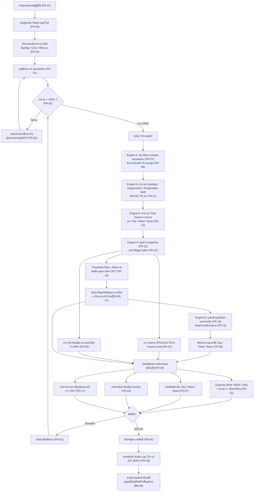
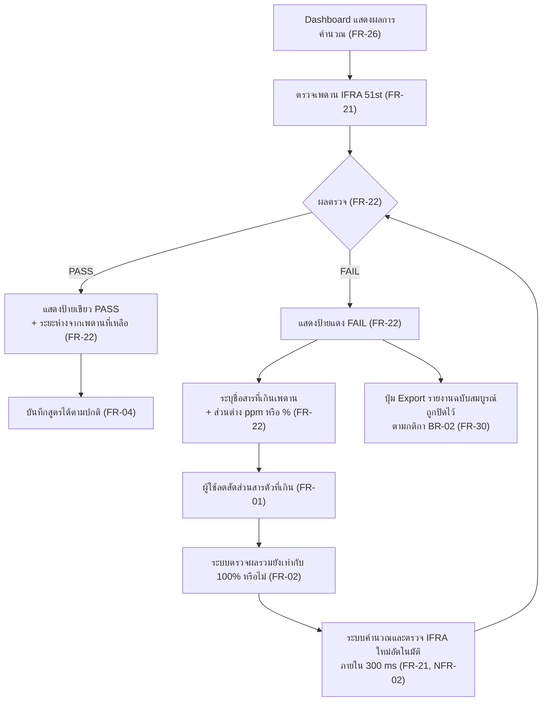

# User Journey — AI Perfumery Formulation Assistant

- **อัปเดตล่าสุด:** 2026-08-18
- **ที่มา:** [[feature-list|Feature List]] ← [[../01-requirements/backlog|Product Backlog]] ← [[../01-requirements/01-spec/20260818-01-ai-perfumery-core|Requirement Spec]]
- **หมายเหตุการอ่าน:** ทุก node ในแผนภาพมีรหัส `FR-xx` กำกับ เพื่อให้สาวกลับไปหา Requirement ต้นทางได้เสมอ

---

## Persona หลัก

| หัวข้อ | รายละเอียด |
|---|---|
| **ชื่อสมมติ** | "มาย" — นักปรุงน้ำหอม (Perfumer) |
| **อายุ / ประสบการณ์** | 32 ปี · ปรุงน้ำหอมมา 7 ปี · รับงานให้แบรนด์ขนาดกลาง 3–4 แบรนด์ |
| **พฤติกรรม** | ทำงานกับสูตรที่มีสาร 50–80 ตัว · ปรับสูตรวันละหลายรอบ · ต้องส่งงานให้ลูกค้าตามบรีฟที่ตกลงไว้ |
| **ความเชี่ยวชาญด้านระบบ** | ใช้คอมพิวเตอร์คล่องระดับใช้ Excel ทำสูตร แต่**ไม่ใช่สายเทคนิค** — ไม่อยากอ่านศัพท์โปรแกรมเมอร์ |
| **Pain Points** | ① ปรับสูตรไปมาจนกลิ่นหลุดบรีฟโดยไม่รู้ตัว (Scent Drift) ② ผสมจริงแล้วกลิ่นตีกันเป็นกลิ่นสบู่ ต้องทิ้งทั้งสูตร (Muddy Accord) ③ แก้สารตัวเดียวต้องไล่ตรวจ IFRA ใหม่ทั้งสูตร เสียเวลามาก ④ ผสมจริง 50–80 รอบต่อโปรเจกต์ = ต้นทุนวัตถุดิบสูงมาก |
| **Goal** | ได้สูตรที่ "ผ่านเกณฑ์แน่นอน + ตรงบรีฟ" ก่อนลงมือผสมจริง เพื่อลดรอบแล็บให้เหลือ 3–5 ครั้ง |

---

# UJ-01 — Journey หลัก: ป้อนสูตรและอ่านผลวิเคราะห์บน Dashboard

> **ครอบคลุมฟีเจอร์:** F-01, F-02, F-03, F-04, F-05, F-06, F-07, F-08
> **นี่คือ Journey ที่เลือกทำ Prototype และ Test Spec ให้ครบสาย**

## แผนภาพ

## คำอธิบายตามลำดับขั้น

| # | ขั้นตอน | สิ่งที่ผู้ใช้เห็น/ทำ | FR |
|---|---|---|---|
| 1 | **เข้าสู่ระบบ** | มายล็อกอินด้วยบัญชีของตัวเอง ระบบแสดงเฉพาะสูตรที่เป็นของเธอ | FR-37 |
| 2 | **เปิด/สร้างสูตร** | เลือกเปิดสูตรเดิมที่ค้างไว้ หรือกดสร้างสูตรใหม่ | FR-04 |
| 3 | **เลือกสาร** | ค้นสารจากคลังด้วยชื่อสามัญ, CAS Number หรือรหัสภายใน แล้วเพิ่มเข้าสูตร | FR-03 |
| 4 | **ระบุสัดส่วน** | ใส่ % ของแต่ละสาร ระบบคำนวณผลรวมให้เห็นตลอดเวลา | FR-01 |
| 5 | **ตรวจผลรวม** | ถ้ายังไม่ครบ 100% ระบบแสดงส่วนต่างและ**ปิดปุ่มคำนวณไว้** จนกว่าจะแก้ครบ | FR-02 |
| 6 | **Engine A ทำงาน** | ระบบระบุกลุ่มของแต่ละสาร รวมน้ำหนักกลุ่ม แล้วดึงค่าปฏิกิริยาจาก Matrix ที่คำนวณล่วงหน้า | FR-07 – FR-11 |
| 7 | **คำนวณการระเหย** | คำนวณพฤติกรรมตามเวลาเพื่อแยกว่าอะไรเป็น Top / Heart / Base | FR-12 |
| 8 | **สรุปค่าคุณสมบัติ** | ได้ค่า Longevity (เป็นช่วงชั่วโมง) และ Sillage Index | FR-13, FR-14 |
| 9 | **กรองด้วย ODT** | เทียบ ppm ที่ระเหยจริงกับเกณฑ์ต่ำสุดที่จมูกรับรู้ได้ แล้วตัดสารที่ต่ำกว่าออกจากบรีฟ | FR-16, FR-17 |
| 10 | **Engine B เขียนบรีฟ** | แปลงตัวเลขทั้งหมดเป็นคำบรรยายกลิ่นที่อ่านเข้าใจง่าย โดย**อ้างอิงได้เฉพาะค่าจาก Engine A** | FR-18, FR-19, FR-20 |
| 11 | **ตรวจความปลอดภัย** | ตรวจเพดาน IFRA และตรวจจับ Muddy Accord ขนานกันไปกับการเขียนบรีฟ | FR-21, FR-23 |
| 12 | **Dashboard แสดงผล** | ผลทั้งหมดปรากฏในหน้าเดียวทันทีที่คำนวณเสร็จ | FR-26 |
| 13 | **อ่านผล 4 ส่วน** | ① พีระมิดกลิ่น ② สถานะ IFRA พร้อมสารที่เกิน ③ คำเตือน Muddy ④ รายการสารที่ถูกตัด | FR-27, FR-22, FR-23, FR-17 |
| 14 | **ตัดสินใจ** | ถ้ายังไม่พอใจ → วนกลับไปปรับสัดส่วน (ระบบคำนวณใหม่ทันที) · ถ้าพอใจ → บันทึก | FR-01, FR-04 |
| 15 | **บันทึกร่องรอย** | ระบบเก็บ Audit Log ว่าใครแก้อะไรเมื่อไหร่ | FR-38 |
| 16 | **ส่งต่อให้มนุษย์** | มายนำสูตรไปผสมจริง — **ระบบไม่อนุมัติสูตรแทนมนุษย์** | BR-06 |

### 🎯 จุดที่ Journey นี้แก้ Pain Point

| Pain Point เดิม | จุดที่แก้ใน Journey | ผลลัพธ์ |
|---|---|---|
| ปรับสูตรจนหลุดบรีฟโดยไม่รู้ตัว | ขั้น 10 + 13 — เห็นคำบรรยายกลิ่นใหม่ทุกครั้งที่แก้ | รู้ทันทีว่ากลิ่นเปลี่ยนไปทางไหน |
| กลิ่นตีกันไร้มิติ | ขั้น 11 + 13 — คำเตือน Muddy Accord | จับได้บนหน้าจอ ไม่ต้องทิ้งทั้งสูตร |
| ต้องไล่ตรวจ IFRA ใหม่ทุกครั้ง | ขั้น 11 — ตรวจ real-time อัตโนมัติ | ไม่ต้องตรวจมือเลย |
| ผสมจริง 50–80 รอบ | ขั้น 14 — วนแก้บนหน้าจอ ไม่ใช่ในแล็บ | เหลือผสมจริง 3–5 รอบ |

---

# UJ-02 — Journey รอง: เจอ IFRA FAIL แล้วแก้สูตรจนผ่าน

> **ครอบคลุมฟีเจอร์:** F-05, F-01, F-02, F-07 · เป็น Journey ย่อยที่แตกจากขั้นที่ 13 ของ UJ-01

## แผนภาพ

## คำอธิบายตามลำดับขั้น

| # | ขั้นตอน | สิ่งที่ผู้ใช้เห็น/ทำ | FR / กติกา |
|---|---|---|---|
| 1 | ระบบตรวจ IFRA ทันทีที่คำนวณเสร็จ | ผู้ใช้ไม่ต้องกดอะไรเพิ่ม | FR-21 |
| 2 | **กรณี PASS** | ป้ายเขียว + บอกว่ายังเหลือระยะห่างจากเพดานเท่าไร (เผื่อปรับต่อ) | FR-22 |
| 3 | **กรณี FAIL** | ป้ายแดง + **ชื่อสารที่เกิน** + ส่วนต่างเป็น ppm หรือ % | FR-22 |
| 4 | ผู้ใช้แก้ | ลดสัดส่วนสารตัวที่เกิน แล้วชดเชยด้วยสารอื่นให้ครบ 100% | FR-01, FR-02 |
| 5 | ระบบตรวจซ้ำอัตโนมัติ | ไม่ต้องกดคำนวณใหม่ — ตรวจให้ภายใน 300 ms | FR-21, NFR-02 |
| 6 | วนจนกว่าจะ PASS | ทำซ้ำขั้น 3–5 | — |
| 7 | ระหว่างที่ยัง FAIL | **ปุ่ม Export รายงานฉบับสมบูรณ์ถูกปิด** — กันไม่ให้ส่งสูตรผิดกฎหมายออกไป | BR-02, FR-30 |

---

## ตารางตรวจสอบความครบถ้วน (Traceability)

| Journey | ฟีเจอร์ที่ครอบคลุม | FR ที่ปรากฏในแผนภาพ |
|---|---|---|
| **UJ-01** | F-01, F-02, F-03, F-04, F-05, F-06, F-07, F-08 | FR-01, 02, 03, 04, 07, 08, 09, 10, 11, 12, 13, 14, 16, 17, 18, 19, 20, 21, 22, 23, 26, 27, 37, 38 |
| **UJ-02** | F-05, F-01, F-07 | FR-01, 02, 04, 21, 22, 26, 30 + NFR-02 |

**FR ระดับ Must ที่ยังไม่ปรากฏใน Journey ใด:** FR-39 (การจัดการความยินยอม PDPA) — เป็น flow ตั้งค่าบัญชีที่แยกจาก flow การทำงานหลัก จะเพิ่มเป็น UJ-03 เมื่อออกแบบหน้าตั้งค่า

---

## เอกสารที่เกี่ยวข้อง

- Feature List: [[feature-list]]
- Backlog: [[../01-requirements/backlog]]
- Acceptance Criteria: [[../03-testing/01-test-plan/acceptance-criteria]]
- Prototype: [[01-prototypes/index]]
